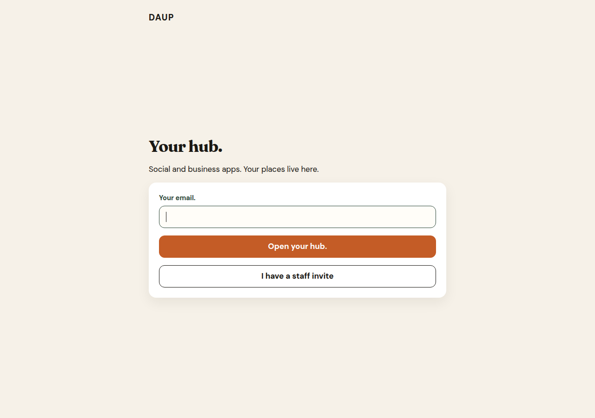
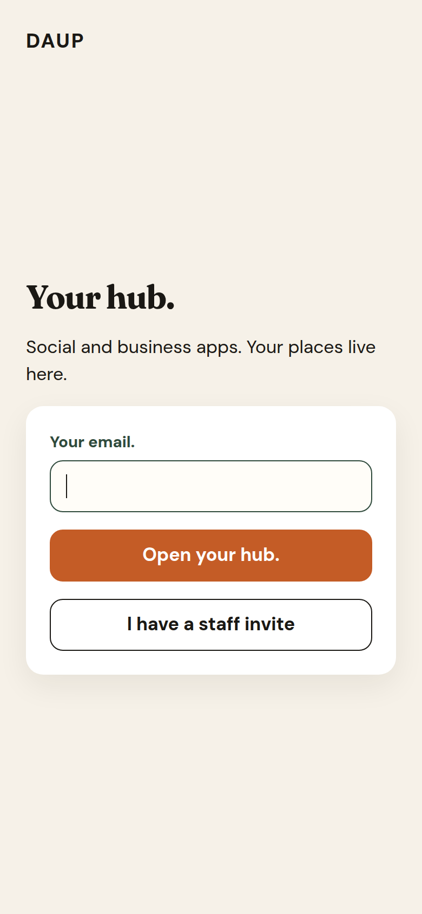
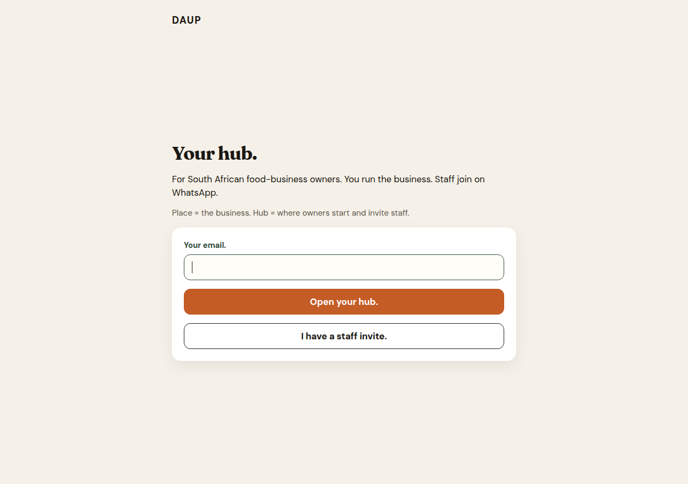
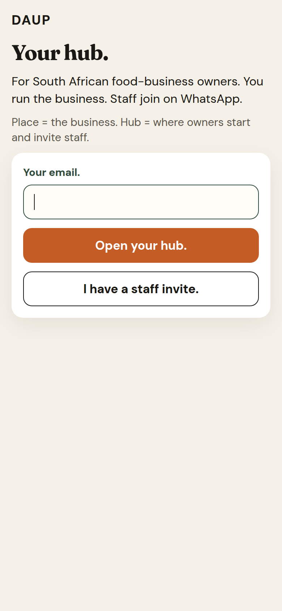

# Change set 1 — signed-out gate

Clarity for the Hub gate on app.daup.co.za. Same Places · Apps · You chrome. Words only.

A stranger should see what this is and the next tap as fast as a category line on a shop home.

## What the gate says

- **Your hub.**
- For South African food-business owners. You run the business. Staff join on WhatsApp.
- Place = the business. Hub = where owners start and invite staff.
- **Your email.** is the only owner path.
- Primary: **Open your hub.**
- Secondary: **I have a staff invite.**

Owner chrome uses **place** for the business. **House** stays a protocol name (house node, house session), not a label.

## Before

Live fail state: the gate named the hub and not who it is for.

## After

Mobile: **Open your hub.** sits above the fold. Email, primary, and staff invite are 48px (`--tap`).
