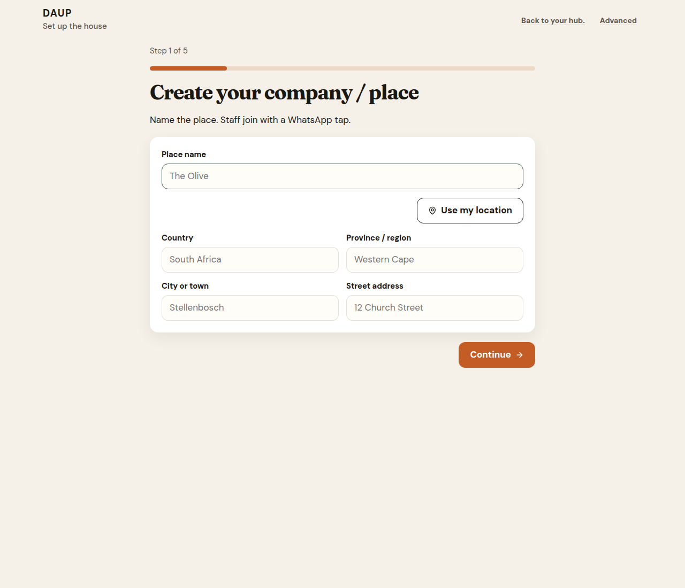
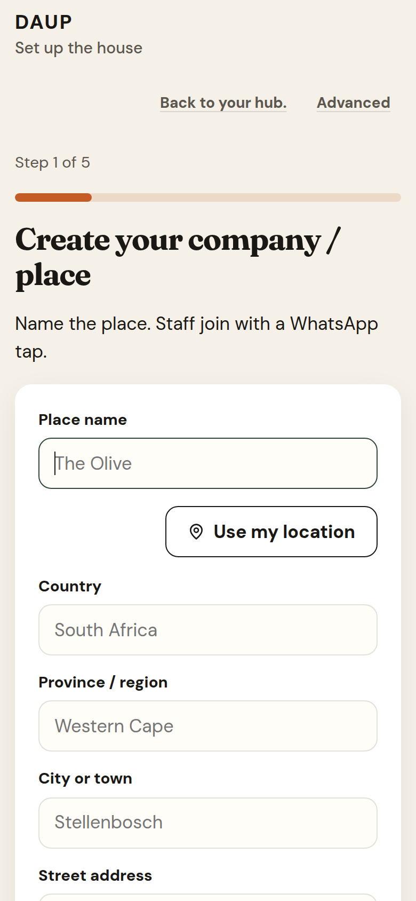
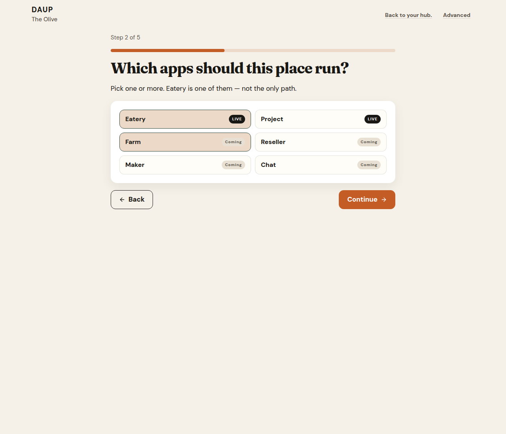
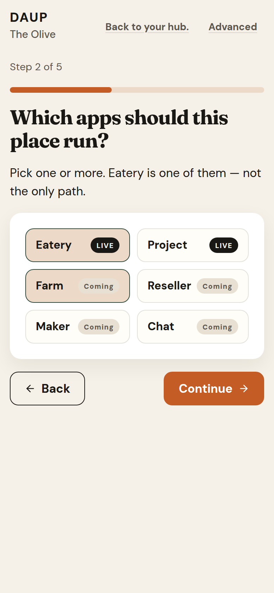
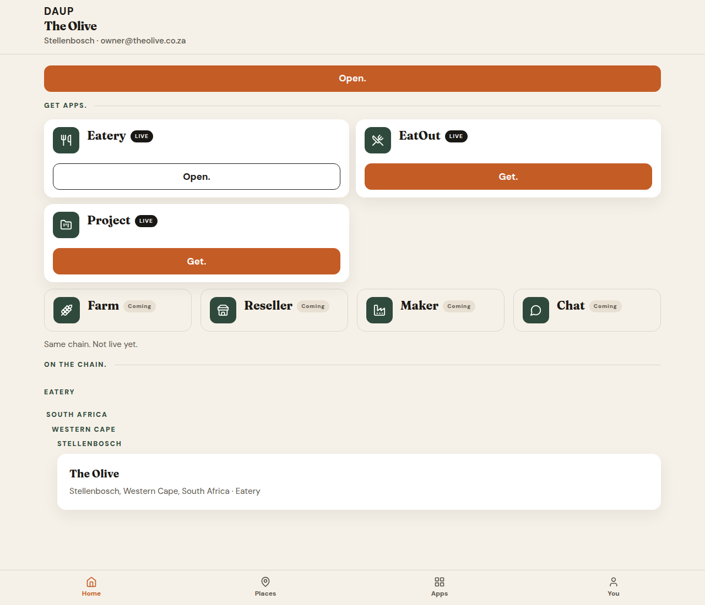
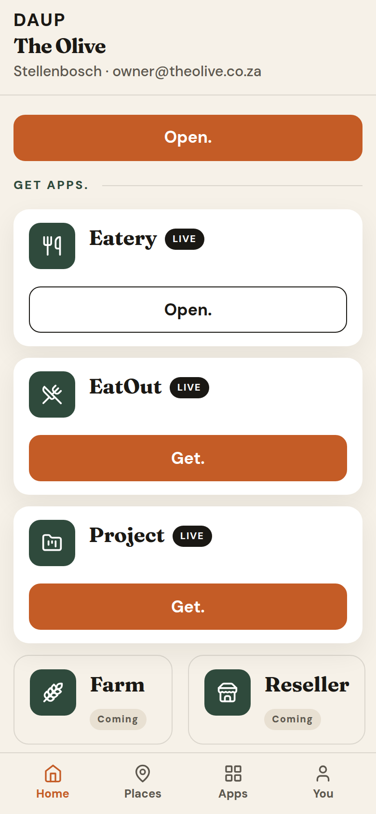
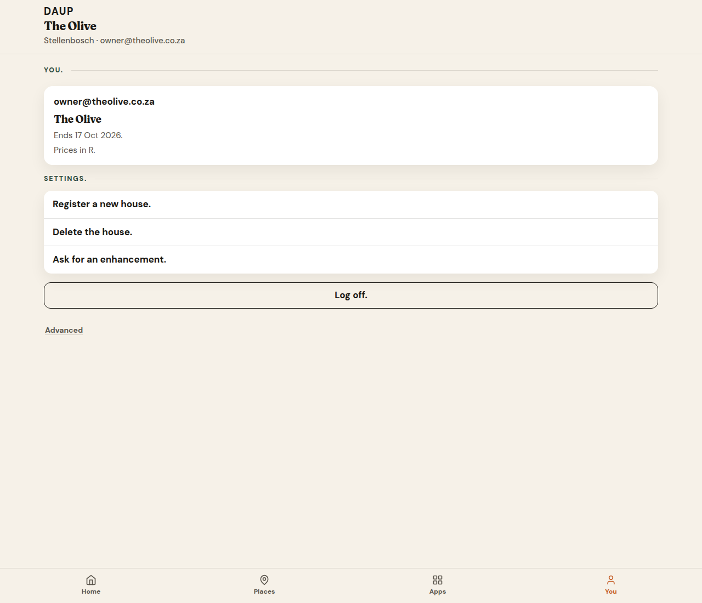
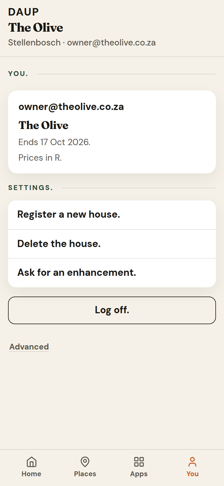
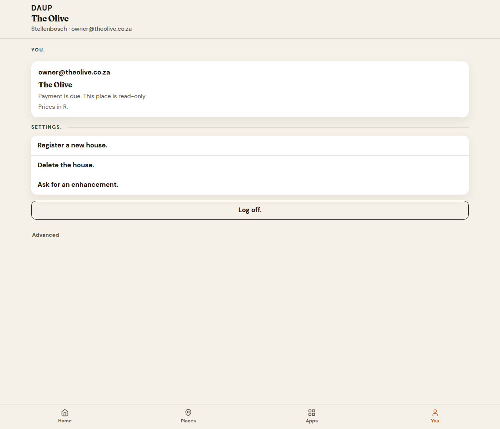
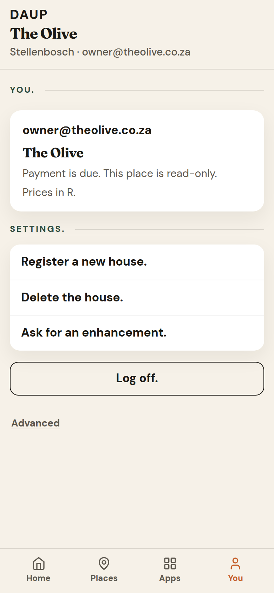

# PR 18 — Place-first Hub registration

Kitchen stills from Hub (Vite + system Chrome, `scripts/capture-ux-pr-18.mjs`). Not placeholders.

- Theme: daup-theme cream / terracotta / forest
- Taps: `--tap: 48px` on Continue, Open., Get., app chips, thumb nav
- Desktop 1280×1100 · mobile 390×844 @2x
- No peer / DID / MCP / node / `co_` ids on doors

## wizard-create-place-desktop.png

Step 1 of 5. First-time **Register**.

- Title: **Create your company / place**
- Sub: *Name the place. Staff join with a WhatsApp tap.*
- Fields: Place name · Country · Province / region · City or town · Street address
- **Use my location** · terracotta **Continue**
- Quiet: **Back to your hub.** · Advanced (off)

Same frame is copied to `docs/ux/register-opens-wizard.png`.

## wizard-create-place-mobile.png

390-wide. Title wraps. Street address and **Continue** sit below the fold on 844-tall.

## wizard-enable-apps-desktop.png

Step 2 of 5. Multi-select. Eatery is one chip among others — not the only path.

- Title: **Which apps should this place run?**
- Sub: *Pick one or more. Eatery is one of them — not the only path.*
- Chips: **Eatery** LIVE · **Project** LIVE · **Farm** Coming · **Reseller** Coming · **Maker** Coming · **Chat** Coming
- This still: Eatery + Farm on
- EatOut is not a chip (consumer, not a place app)
- **Back** · **Continue**

## wizard-enable-apps-mobile.png

Same copy. Two-column chips. **Back** and **Continue** stay in frame.

## home-place-bound-desktop.png

After **See your apps**. Place bound. No remint chrome.

- Context: **The Olive** · Stellenbosch · email
- Home **Open.** terracotta primary
- **Get apps.** Eatery LIVE **Open.** (outline) · EatOut LIVE **Get.** · Project LIVE **Get.**
- Coming: Farm · Reseller · Maker · Chat — *Same chain. Not live yet.*
- **On the chain.** The Olive, Stellenbosch — no protocol ids
- Thumb: **Home / Places / Apps / You**

## home-place-bound-mobile.png

Same doors stacked. Coming row clips above the thumb.

## you-trial-desktop.png

**You.** after mint. Trial chrome is kitchen English only.

- Email · **The Olive**
- *Ends 17 Oct 2026.*
- *Prices in R.*
- Settings: **Register a new house.** · **Delete the house.** · **Ask for an enhancement.**
- **Log off.** · Advanced (off, protocol stays behind it)

## you-trial-mobile.png

Same copy. Thumb **You** on.

## you-past-due-desktop.png

Trial ended, grace. No trial date.

- *Payment is due. This place is read-only.*
- *Prices in R.*

## you-past-due-mobile.png

Same caption.

## you-paused-desktop.png

After grace. Writes closed.

- *This place is paused. Writes are closed.*
- *Prices in R.*

## you-paused-mobile.png

Same caption.
