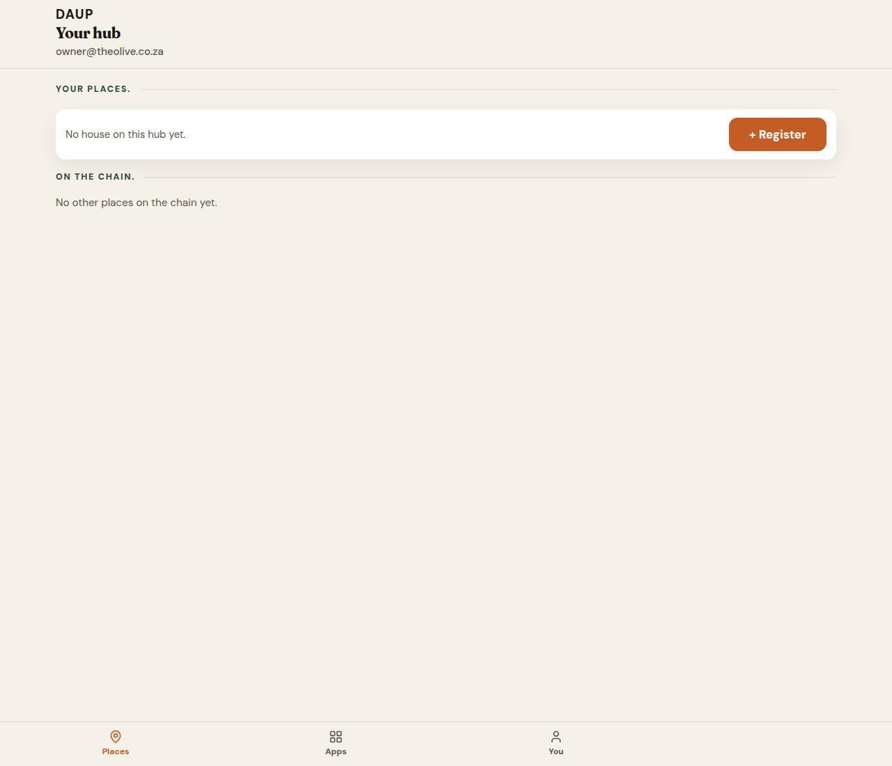
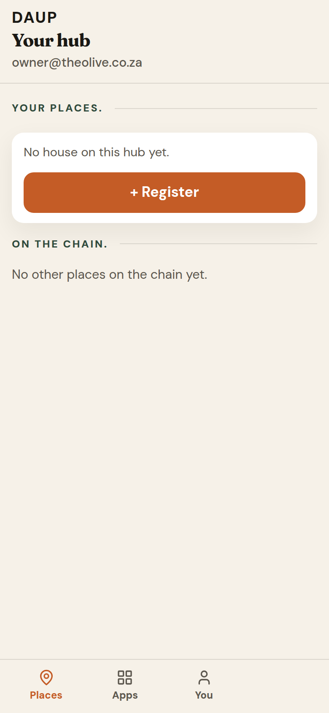
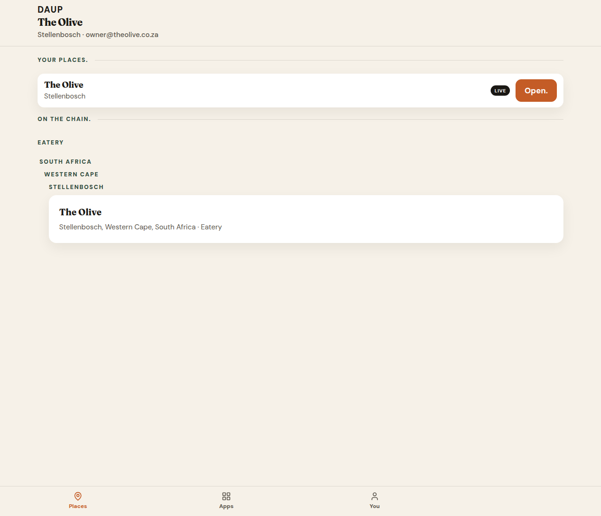
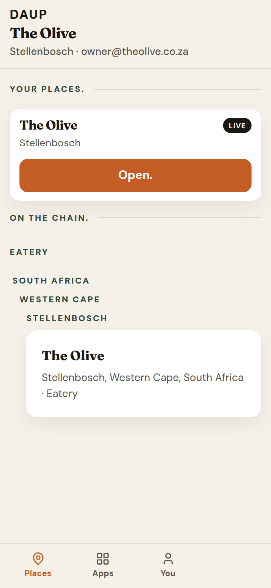
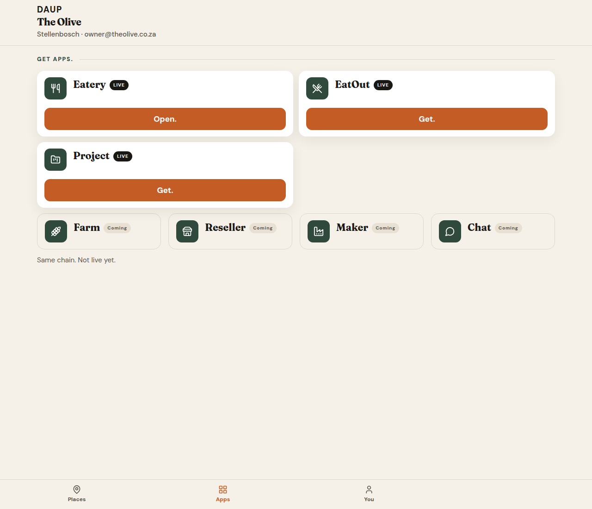
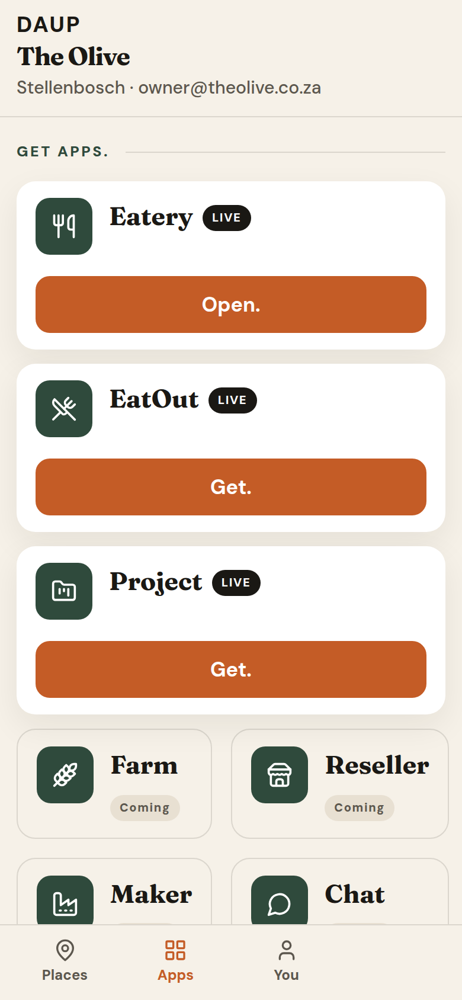
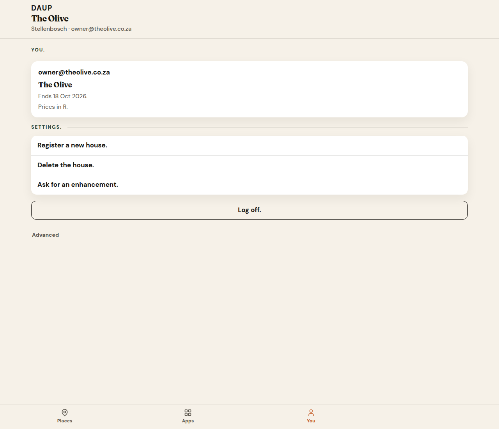
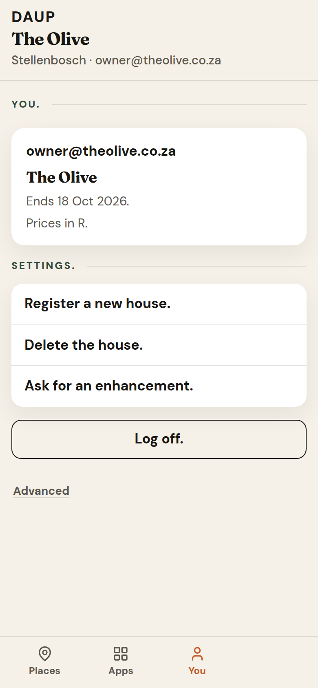

# PR 19 — Remove Hub Home; land on Places

Kitchen stills from Hub (Vite + system Chrome, `scripts/capture-ux-pr-19.mjs`). Not placeholders.

- Theme: daup-theme cream / terracotta / forest
- Desktop 1280×1100 · mobile 390×844 @2x
- Thumb: **Places / Apps / You** — no Home
- Default signed-in pane: **Places**
- No peer / DID / MCP / node / `co_` ids on doors

## Why Places, not Apps

Home was Open. + Get apps. + On the chain. After place-first registration that is Places (bound place / Open. / + Register / On the chain.) plus Apps (Get apps.). Landing on Places puts the owner on the bound place (or empty + Register). Apps is the shop — useful, not first.

## places-default-desktop.png

After **Open your hub.** No house. No Home tab.

- Context: **Your hub** · email
- **Your places.** *No house on this hub yet.* terracotta **+ Register**
- **On the chain.** *No other places on the chain yet.*
- Thumb: **Places / Apps / You** — Places on

## places-default-mobile.png

Same copy. **+ Register** is a full-width terracotta tap. Thumb has three items.

## places-bound-desktop.png

After **See your apps**. Place bound. Default pane is Places.

- Context: **The Olive** · Stellenbosch · email
- **Your places.** The Olive · Stellenbosch · LIVE · terracotta **Open.**
- **On the chain.** The Olive, Stellenbosch — no protocol ids
- Thumb: **Places / Apps / You** — Places on

## places-bound-mobile.png

Same doors stacked. **Open.** is a 48px terracotta tap.

## apps-desktop.png

Thumb **Apps**. Shop only — no place row, no Home CTA.

- **Get apps.** Eatery LIVE **Open.** (terracotta) · EatOut LIVE **Get.** · Project LIVE **Get.**
- Coming: Farm · Reseller · Maker · Chat — *Same chain. Not live yet.*
- No `co_` / peer / DID / MCP / node

## apps-mobile.png

Same copy stacked. Coming row still clips above the thumb (parked from #18 — not fixed here).

## you-desktop.png

**You.** after mint. Kitchen English only.

- Email · **The Olive**
- *Ends 18 Oct 2026.*
- *Prices in R.*
- Settings: **Register a new house.** · **Delete the house.** · **Ask for an enhancement.**
- **Log off.** · Advanced (off, protocol stays behind it)
- Thumb: **Places / Apps / You** — You on

## you-mobile.png

Same copy. Thumb **You** on.

## Copy check

Doors scanned in these stills: no `peer`, `DID`, `MCP`, `node`, or `co_` on Places / Apps / You chrome.
