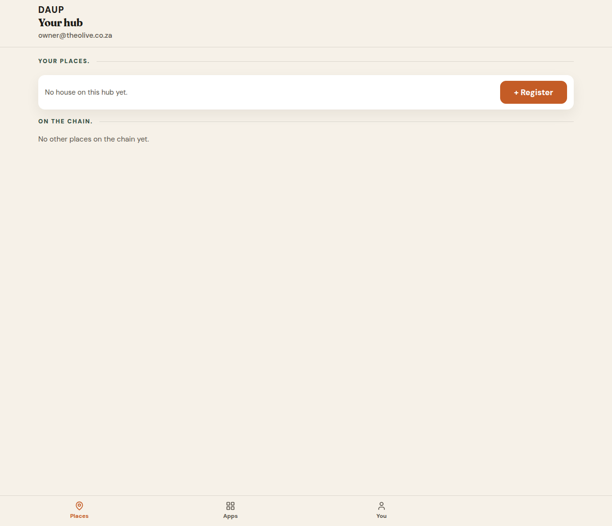
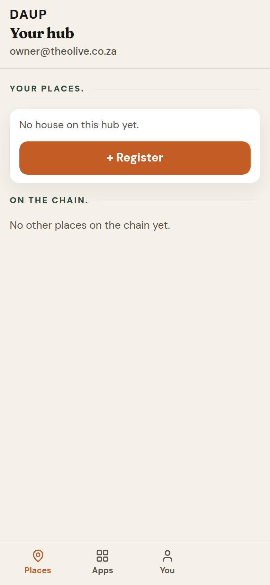
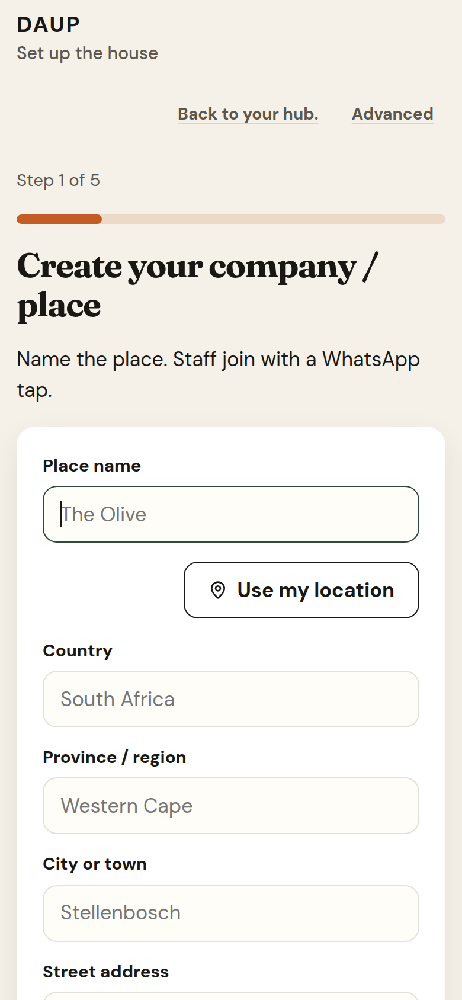
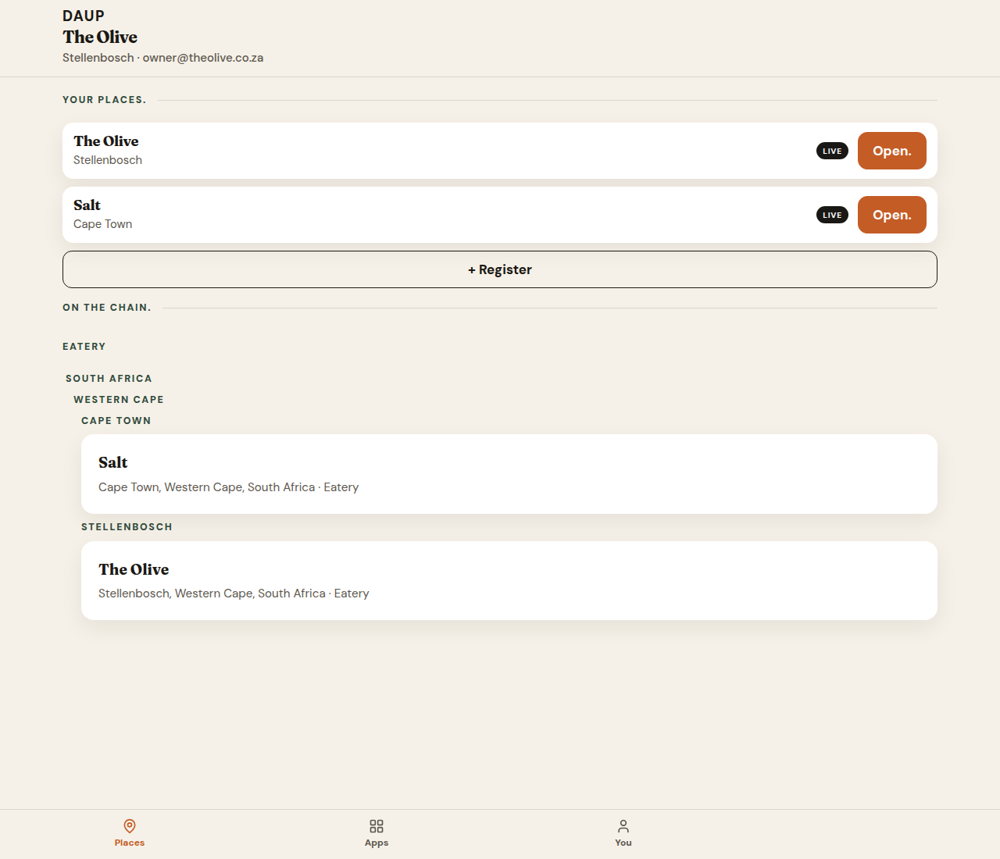
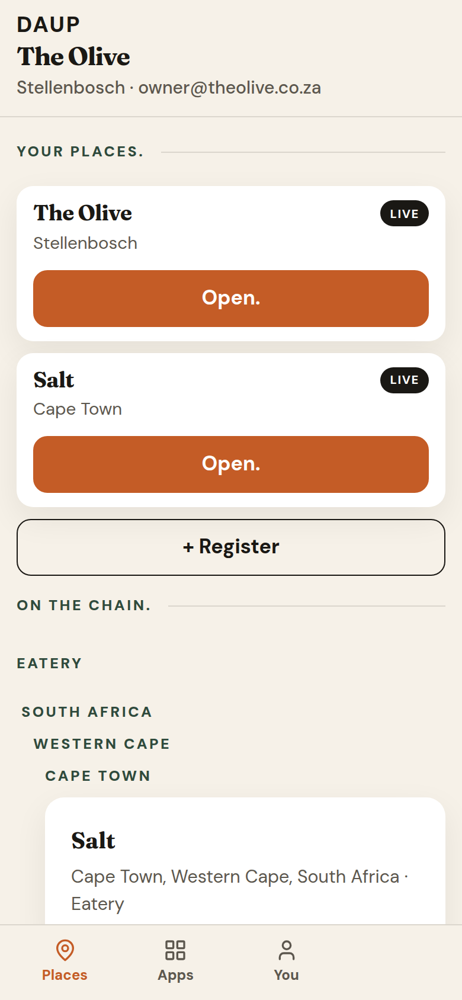
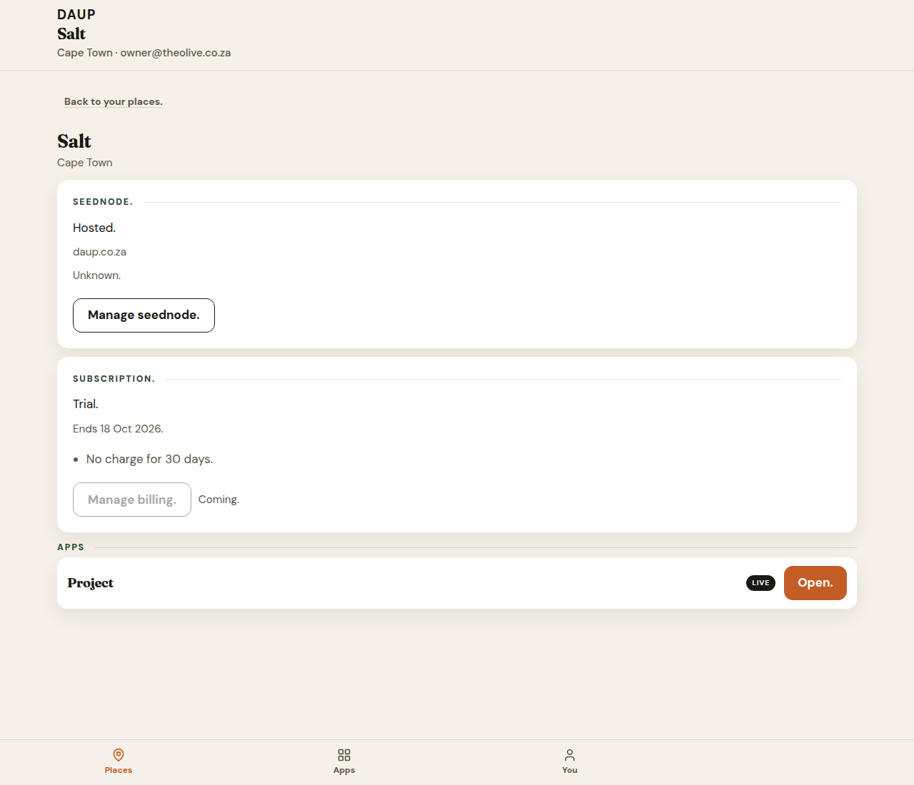
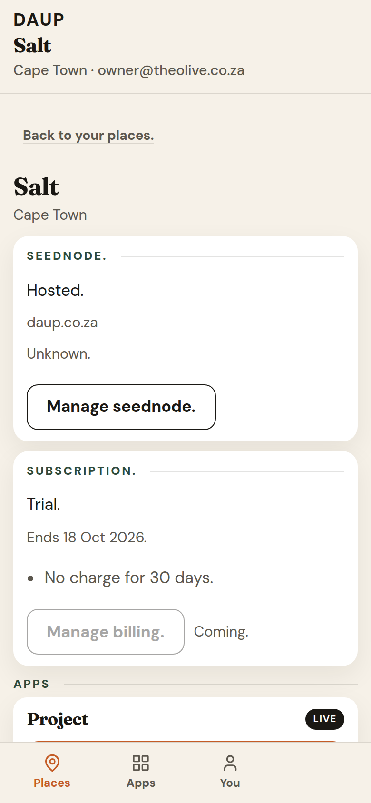

# PR 20 — Place list + place control plane (P0 + P1)

Kitchen stills from Hub (Vite + system Chrome, `scripts/capture-ux-pr-20.mjs`). Not placeholders.

- Theme: daup-theme cream / terracotta / forest
- Desktop 1280×1100 · mobile 390×844 @2x
- Thumb: **Places / Apps / You** — no Home
- Default signed-in pane: **Places**
- Opening a place is that place’s control plane (seed + subscription + apps)
- No peer / DID / MCP / node / `co_` ids on doors

## places-empty-desktop.png

After **Open your hub.** No house.

- Context: **Your hub** · email
- **Your places.** *No house on this hub yet.* terracotta **+ Register**
- **On the chain.** *No other places on the chain yet.*
- Thumb: **Places / Apps / You** — Places on

## places-empty-mobile.png

Same copy. **+ Register** is a full-width terracotta tap.

## wizard-create-place-desktop.png

Same wizard shape as #18. Used for the first place and for another place.

- Title: **Create your company / place**
- Sub: *Name the place. Staff join with a WhatsApp tap.*
- Fields: Place name · Country · Province / region · City or town · Street address
- **Use my location** · terracotta **Continue**

## wizard-create-place-mobile.png

390-wide. Street address and **Continue** may sit below the fold on 844-tall (parked from #18).

## places-two-desktop.png

Two places on this hub. First place was not wiped.

- **Your places.** The Olive · Stellenbosch · LIVE · **Open.** · Salt · Cape Town · LIVE · **Open.**
- **+ Register** to create another
- **On the chain.** both places — no protocol ids

## places-two-mobile.png

Same doors stacked. **Open.** is a 48px terracotta tap.

## place-detail-desktop.png

**Open.** on Salt. Not Eatery / Project.

- Context switches to **Salt** · Cape Town · email
- **Back to your places.**
- **Salt** · Cape Town
- **Seednode.** Hosted. · daup.co.za · Unknown. · **Manage seednode.**
- **Subscription.** Trial. · Ends date · *No charge for 30 days.* · **Manage billing.** Coming.
- **Apps** Project LIVE **Open.**

## place-detail-mobile.png

Same three blocks stacked.

## Copy check

Doors scanned in these stills: no `peer`, `DID`, `MCP`, `node`, or `co_` on Places list, create flow, or place detail. Endpoint label is **daup.co.za** (not the mcp host). **Seednode.** is one kitchen word.
