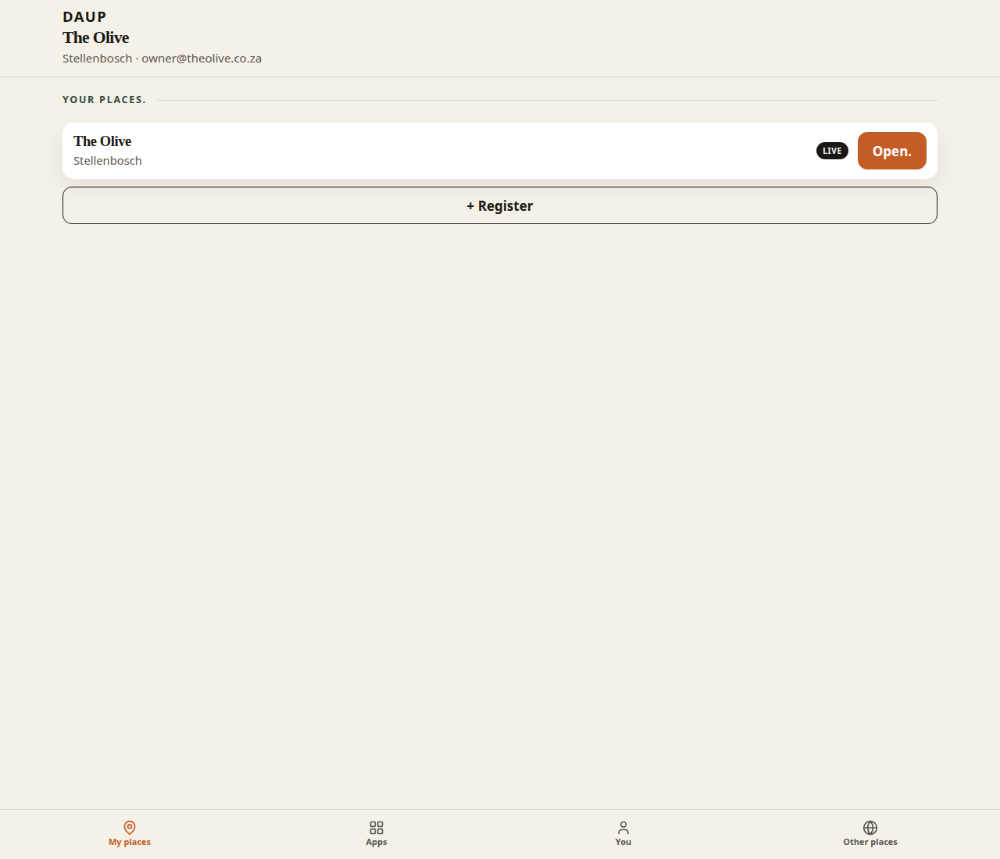
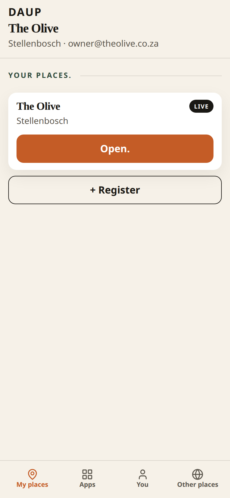
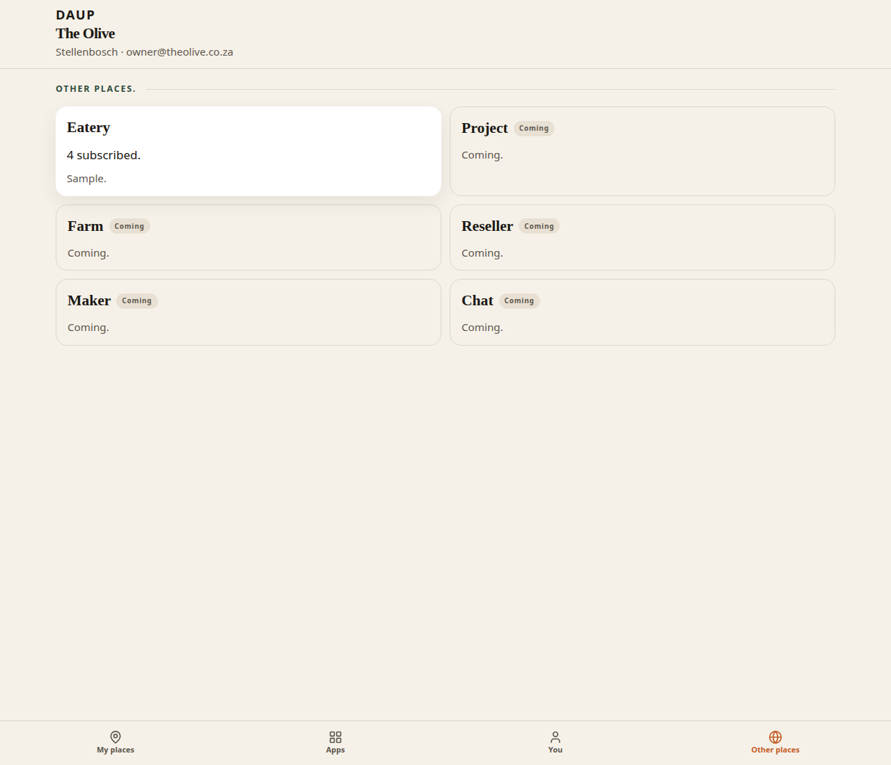
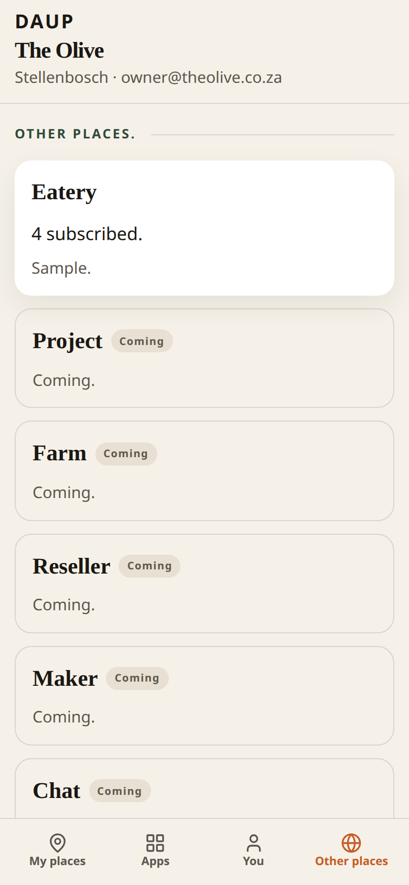
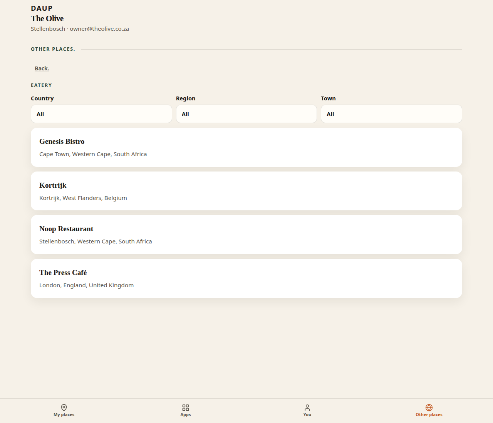
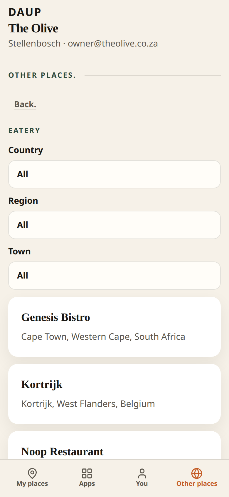
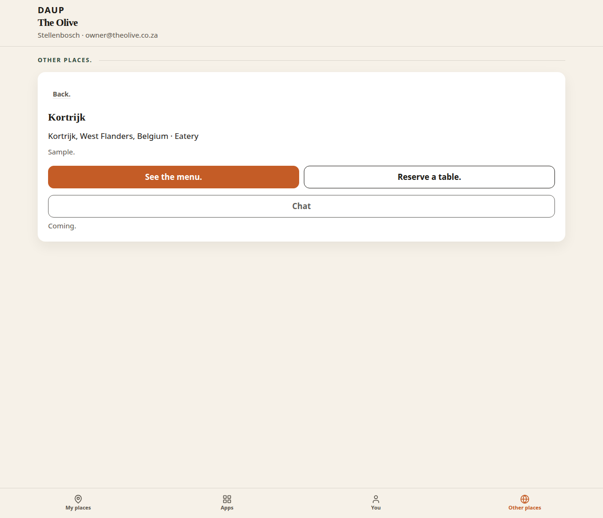
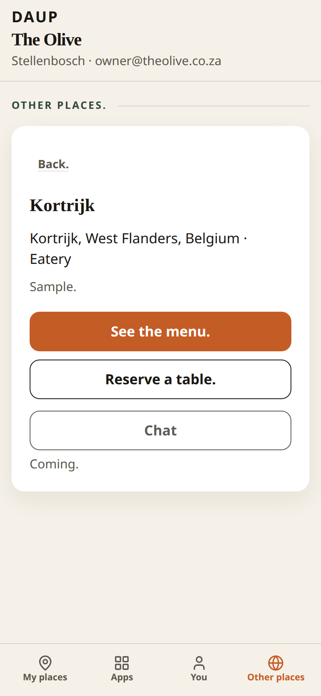

# PR 21 — My places / Other places Hub IA

Kitchen stills from Hub (Vite + system Chrome, `scripts/capture-ux-pr-21.mjs`). Not placeholders.

- Theme: daup-theme cream / terracotta / forest
- Desktop 1280×1100 · mobile 390×844 @2x
- Thumb: **My places · Apps · You · Other places** (Other places far right)
- Default signed-in pane: **My places**
- Kitchen doors only. Protocol ids stay off chrome.

## Why this split

My places is the owner control plane from #20 (list / create / Open. into Seed. + Subscription. + Apps). Other people’s places do not belong on that pane. Other places is a directory of public surfaces, starting with Eatery via EatOut.

## Stub vs live discovery

There is no live public directory API on Hub. Other places uses a **sample** Eatery list (Kortrijk, Genesis Bistro, Noop Restaurant, The Press Café) and, when present, other places already registered on this hub that are not yours.

- Card count: **N subscribed.**
- Source line: **Sample.** or **On this hub.** or both

## Deep links (Eatery public)

Reuse EatOut, do not invent a parallel diner app:

- See the menu. → `https://eatout.daup.co.za/place/{slug}#menu`
- Reserve a table. → `https://eatout.daup.co.za/place/{slug}#book`
- Chat → **Coming.** (disabled; not a live chat)

Kortrijk / Genesis / Noop slugs match EatOut’s live ids.

## my-places-desktop.png

After **See your apps**. Owned list only.

- Context: **The Olive** · Stellenbosch · email
- **Your places.** The Olive · Stellenbosch · LIVE · terracotta **Open.**
- **+ Register**
- On-chain strip removed
- Thumb: **My places · Apps · You · Other places** — My places on

## my-places-mobile.png

Same doors stacked. **Open.** is a 48px terracotta tap. Owned list only.

## other-places-apps-desktop.png

Thumb **Other places**. One card per app.

- **Eatery** — **4 subscribed.** · **Sample.**
- **Project · Farm · Reseller · Maker · Chat** — **Coming.**
- Kitchen English on the cards

## other-places-apps-mobile.png

Same cards stacked. Other places thumb on, far right.

## other-places-filters-desktop.png

After tapping **Eatery**.

- **Back.**
- Filters: **Country · Region · Town** (All)
- List: Kortrijk · Genesis Bistro · Noop Restaurant · The Press Café
- Rows are place name + town, region, country. No protocol ids.

## other-places-filters-mobile.png

Filters stack. 48px selects. List below.

## eatery-public-desktop.png

Selecting Kortrijk. Public card, not owner Floor.

- **Back.**
- Kortrijk · Kortrijk, West Flanders, Belgium · Eatery
- **Sample.**
- terracotta **See the menu.** → `https://eatout.daup.co.za/place/kortrijk#menu`
- **Reserve a table.** → `https://eatout.daup.co.za/place/kortrijk#book`
- **Chat** (quiet, disabled) with **Coming.** under it

## eatery-public-mobile.png

Same doors stacked. Menu is the primary terracotta tap. Chat is Coming.

## Copy check

Doors scanned in these stills:

- Thumb **My places** / **Other places**
- Owned list only on My places
- **N subscribed.** and **Sample.**
- **Country · Region · Town**
- **See the menu.** / **Reserve a table.** / **Chat** **Coming.**
- protocol words stay off doors
