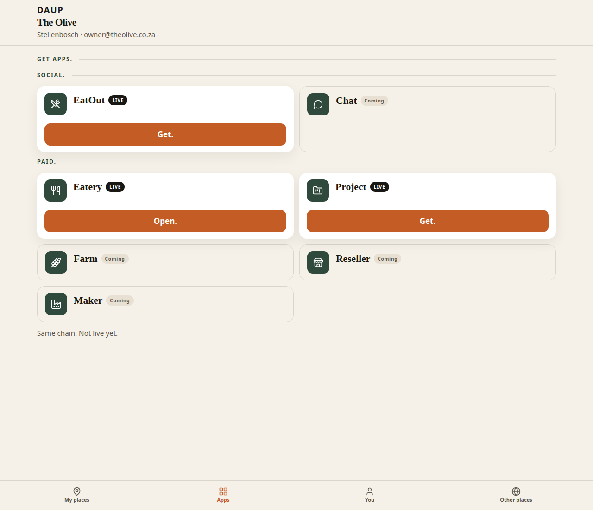
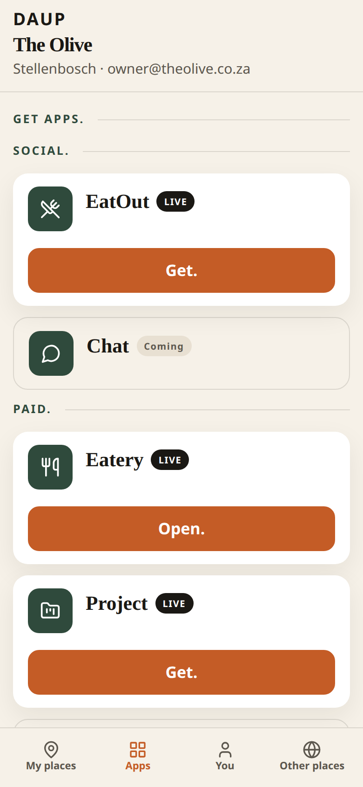
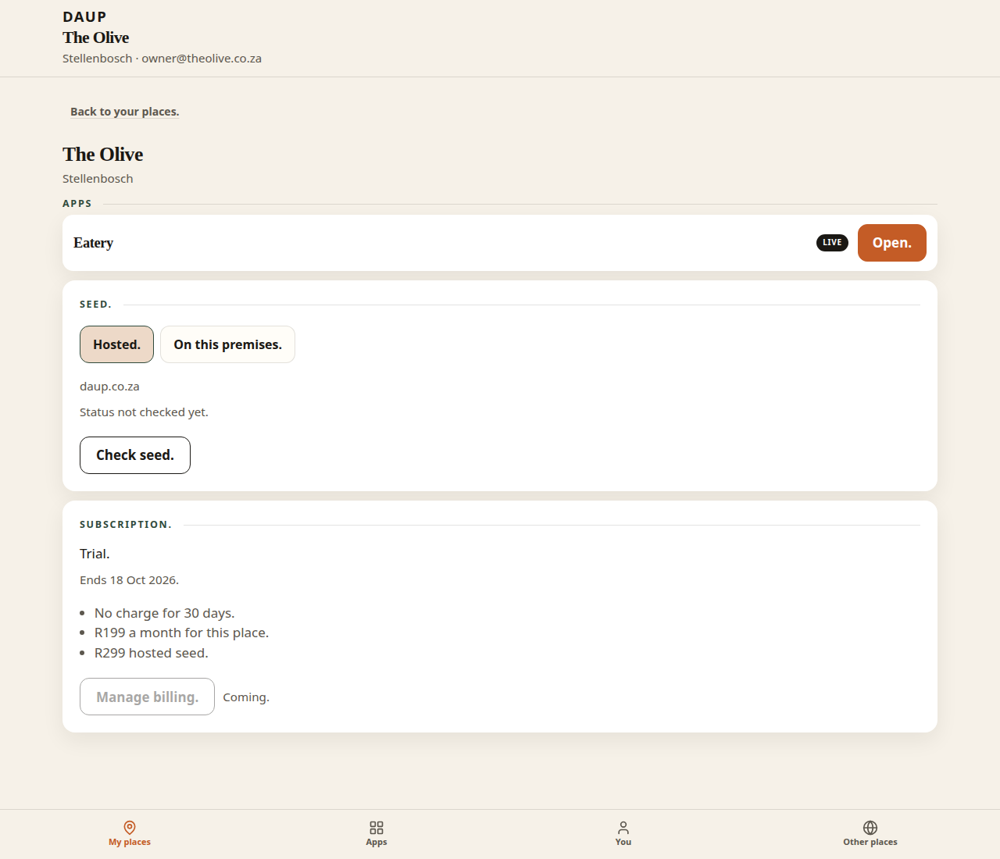
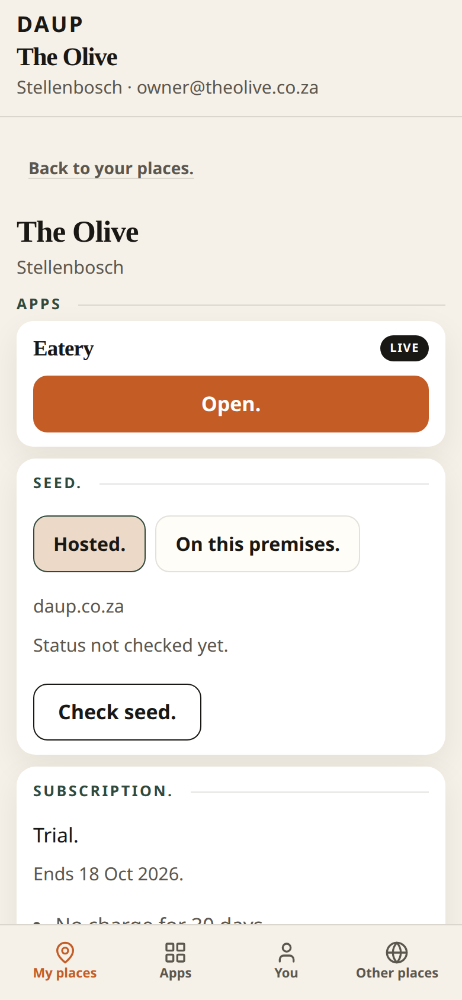
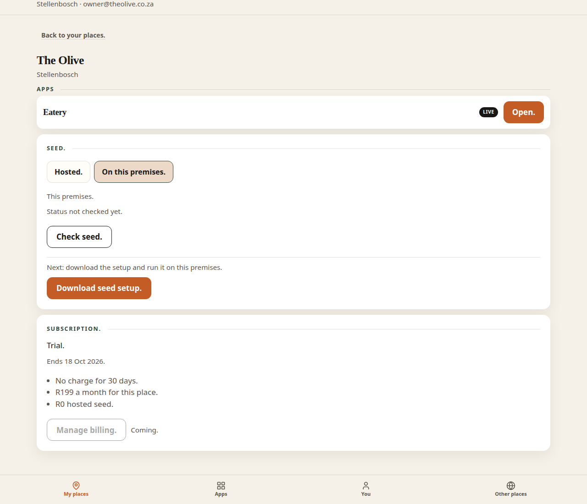
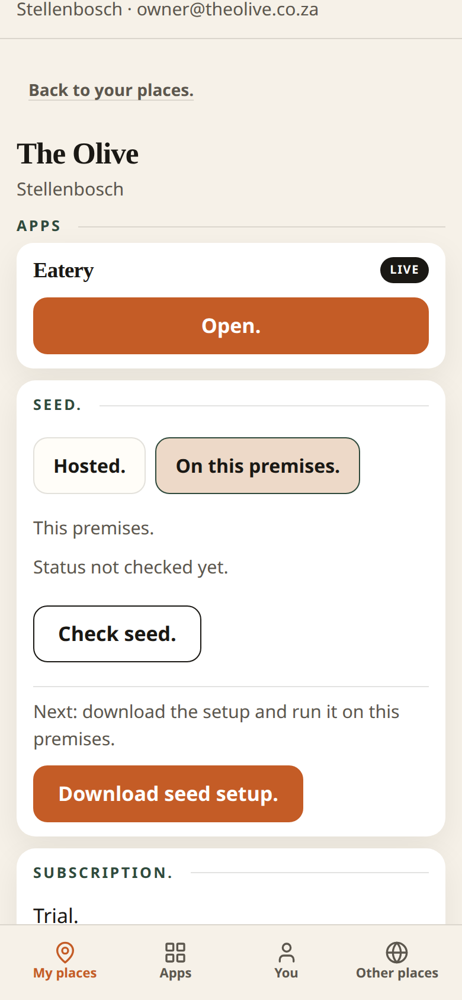

# PR 22 — Apps IA, place apps-on-top, seed mode + meters

Kitchen stills from Hub (Vite + system Chrome, `scripts/capture-ux-pr-22.mjs`). Not placeholders.

- Theme: daup-theme cream / terracotta / forest
- Desktop 1280×1100 · mobile 390×844 @2x
- Thumb: **My places · Apps · You · Other places**
- Kitchen doors only. No peer, DID, MCP, node, or licensed ids on chrome.

## What this pack shows

1. **Apps** — Social. (EatOut, Chat) then Paid. (Eatery, Project, Farm, Reseller, Maker). Coming. where not live.
2. **Place detail** — Apps block on top of the control plane. Seed. and Subscription. stay below.
3. **Seed.** — live **Hosted.** / **On this premises.** choice. Status *Status not checked yet.* · **Check seed.**
4. On this premises: hosted line **R0**; **Download seed setup.** serves `/on-prem/daup-onprem-seed-v0.zip` (v0 operator pack: start-house `.sh`/`.bat`, tunnel, healthcheck).

Meters (stubs): **R199** a month for this place. · **R299** hosted seed. · **R0** hosted seed. when on this premises. Trial 30d unchanged.

## Stub vs real

| | |
| --- | --- |
| **Live** | Apps Social/Paid sections, apps-on-top, Hosted ↔ On this premises persist, fee copy, **Download seed setup.** zip of the v0 operator pack |
| **Pack** | Hub `/on-prem/daup-onprem-seed-v0.zip` mirrors `foli4ier/daup-mcp-servers` `onprem-pack/` v0 (start-house `.sh`/`.bat`, tunnel, healthcheck, README — not a Windows `.exe`). Local smoke `http://127.0.0.1:8080`. Production attach is https. |
| **Attach** | After stand-up Hub persists `{ mode: on-prem, endpoint, ownerEmail, companyId, placeId }` with the opened place’s house id. Licensed id is never reminted. |
| **Stub** | Check seed. / Connected badge (slice C). Customer tunnel hostname. Manage billing. Coming. |

## apps-desktop.png

Thumb **Apps**.

- **Get apps.**
- **Social.** EatOut LIVE **Get.** · Chat **Coming**
- **Paid.** Eatery · Project LIVE · Farm · Reseller · Maker **Coming**
- *Same chain. Not live yet.*
- No peer / DID / MCP / node on doors

## apps-mobile.png

Same sections stacked. Social above Paid.

## place-detail-desktop.png

**Open.** on The Olive.

- **Back to your places.**
- **Apps** Eatery LIVE **Open.** — first block
- **Seed.** **Hosted.** on · daup.co.za · *Status not checked yet.* · **Check seed.**
- **Subscription.** Trial. · *No charge for 30 days.* · *R199 a month for this place.* · *R299 hosted seed.* · **Manage billing.** Coming.

## place-detail-mobile.png

Apps on top. Seed. and Subscription. below.

## place-on-prem-desktop.png

**On this premises.** selected.

- Host label **This premises.**
- *Status not checked yet.* · **Check seed.**
- *Next: download the setup and run it on this premises.*
- terracotta **Download seed setup.** → `/on-prem/daup-onprem-seed-v0.zip`
- Subscription hosted line **R0 hosted seed.** · place sub still **R199 a month for this place.**

## place-on-prem-mobile.png

Same doors. Download is a `.zip`, not an `.exe`.

## Copy check

Doors scanned in these stills:

- **Social.** / **Paid.**
- **Hosted.** / **On this premises.**
- **Status not checked yet.** / **Check seed.**
- **Download seed setup.**
- **R199 a month for this place.** / **R299 hosted seed.** / **R0 hosted seed.**
- protocol words stay off doors
