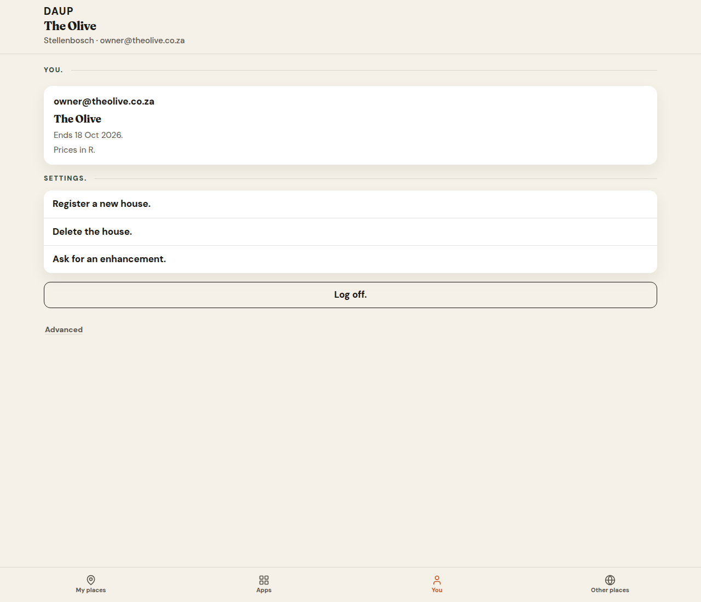
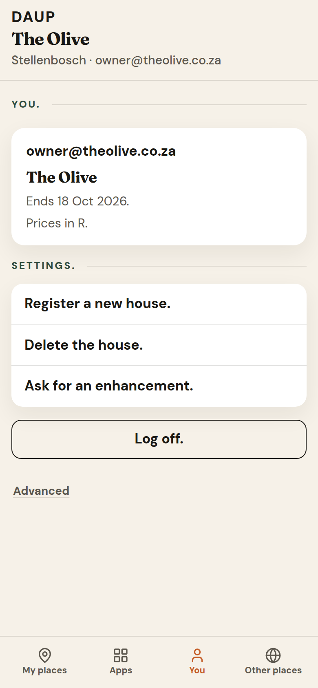

# PR 23 — House admin doors stay on You.

Kitchen stills from Hub (Vite + system Chrome, `scripts/capture-ux-pr-23.mjs`). Not placeholders.

- Theme: daup-theme cream / terracotta / forest
- Desktop 1280×1100 · mobile 390×844 @2x
- Thumb: **My places · Apps · You · Other places**
- Default signed-in pane: **My places**
- Kitchen doors only. No peer, DID, MCP, node, or `co_` on chrome.

## Already on You. — not restored

**Delete the house.**, **Register a new house.**, and **Ask for an enhancement.** were already first-class kitchen doors on **You.** → **Settings.** They were not missing, not buried under Advanced, and not labeled with protocol jargon.

This pack proves they still live there — and nowhere on **My places**, **Apps**, or **Other places**. Open Eatery strips them separately. Soft parks from Hub #18–#22 stay parked.

Kitchen English on the doors (same copy as #18 / #19):

- **Register a new house.** — opens **Create your company / place**
- **Delete the house.** — type-the-name confirm; hidden until there is a house
- **Ask for an enhancement.** — own `/asks` page, not a home section

## you-desktop.png

**You.** after mint. Kitchen English only.

- Email · **The Olive**
- *Ends … 2026.*
- *Prices in R.*
- **Settings.** **Register a new house.** · **Delete the house.** · **Ask for an enhancement.**
- **Log off.** · Advanced (off — protocol stays behind it)
- Thumb: **My places · Apps · You · Other places** — You on

## you-mobile.png

Same three doors stacked. Thumb **You** on.

## Copy check

Doors scanned in these stills:

- **You.** / **Settings.**
- **Register a new house.**
- **Delete the house.**
- **Ask for an enhancement.**
- **Log off.**
- protocol words stay off doors
- none of the three admin doors on My places / Apps / Other places
