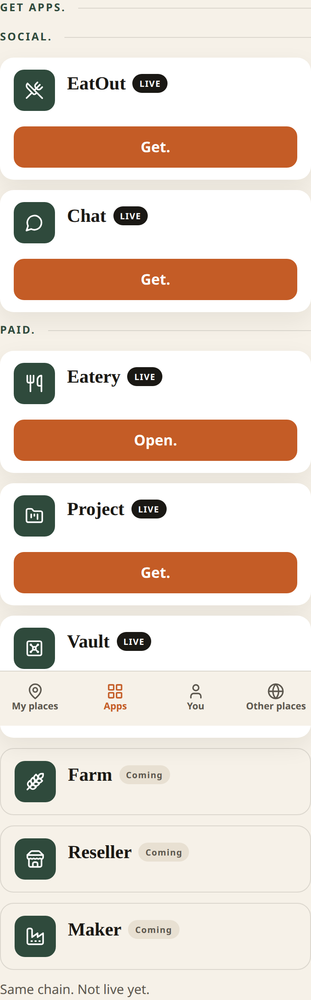
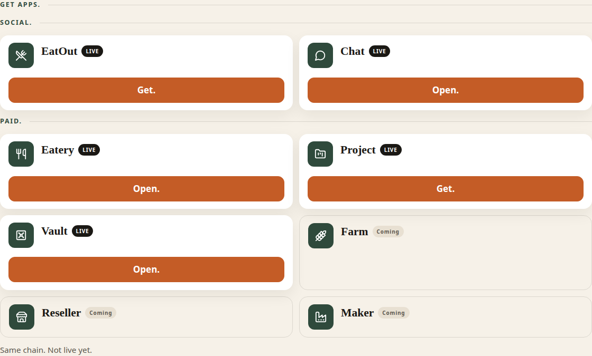
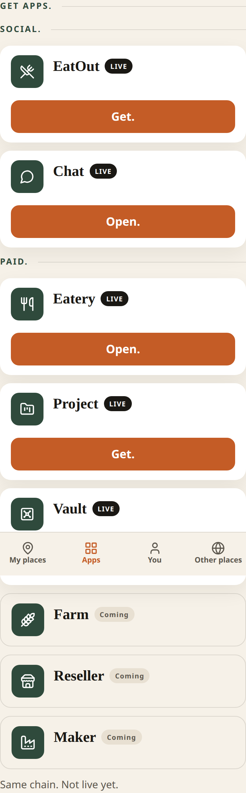
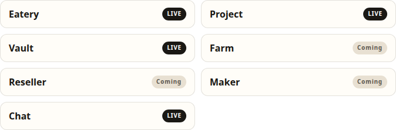
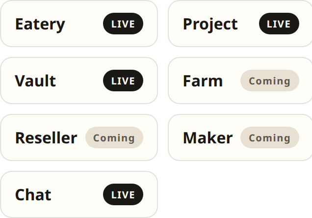
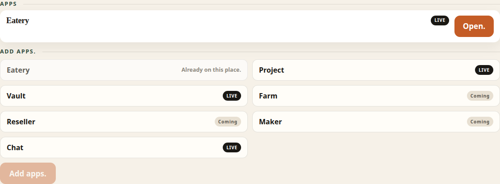
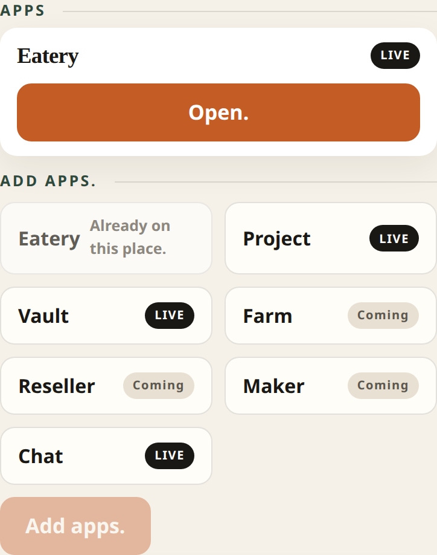

# PR 25 — Vault + Chat LIVE on Apps.

Kitchen stills from Hub (Vite + system Chrome, `scripts/capture-ux-pr-25.mjs`). Not placeholders.

- Theme: daup-theme cream / terracotta / forest
- Desktop 1280 · mobile 390×844 @2x
- Thumb: **My places · Apps · You · Other places**
- Kitchen doors only. No peer, DID, MCP, node, or licensed ids on chrome.

## What this pack shows

1. **Apps** — **Social.** then **Paid.** EatOut + **Chat** are Social. **Vault** is Paid, with Eatery and Project. Farm, Reseller, and Maker stay **Coming**.
2. Chat and Vault are **LIVE** with **Get.** Before a place holds them, and **Open.** after **Get.** Open. is a button. It does not go to `chat.daup.co.za` or `vault.daup.co.za` — those hosts are not wired.
3. **Which apps should this place run?** and place **Add apps.** list Chat and Vault as enableable place apps. EatOut stays off that picker.

## LIVE vs Coming

| Section | LIVE (Get. / Open.) | Coming |
| --- | --- | --- |
| Social | EatOut, Chat | — |
| Paid | Eatery, Project, Vault | Farm, Reseller, Maker |

## apps-desktop.png

**Apps** before Get. on Chat or Vault.

- **Social.** EatOut LIVE **Get.** · Chat LIVE **Get.**
- **Paid.** Eatery LIVE **Open.** · Project LIVE **Get.** · Vault LIVE **Get.**
- Farm, Reseller, Maker **Coming** — no Get.

## apps-mobile.png

Same doors stacked. **Get.** is a 48px terracotta tap.

## apps-open-desktop.png

After **Get.** on Chat and Vault.

- Chat LIVE **Open.**
- Vault LIVE **Open.**
- Open. is a button, not a link to a host that does not resolve.

## apps-open-mobile.png

Same Open. doors stacked.

## wizard-apps-desktop.png

**Which apps should this place run?**

- Eatery, Project, Vault LIVE
- Farm, Reseller, Maker Coming
- Chat LIVE
- No EatOut

## wizard-apps-mobile.png

Same chips stacked.

## place-add-apps-desktop.png

**Open.** on The Olive.

- **Apps** Eatery LIVE **Open.**
- **Add apps.** Eatery **Already on this place.**
- Project, Vault, Farm, Reseller, Maker, Chat pickable
- Vault and Chat marked LIVE

## place-add-apps-mobile.png

Same chips stacked. Already-on Eatery stays disabled.

## Copy check

Doors scanned in these stills:

- **Chat** / **Vault** / **EatOut** / **Eatery** / **Project**
- **Social.** / **Paid.** / **Get.** / **Open.** / **LIVE** / **Coming**
- **Add apps.** / **Already on this place.**
- protocol words stay off doors
