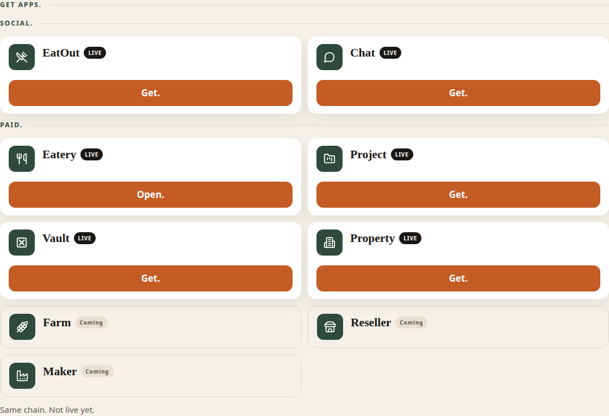
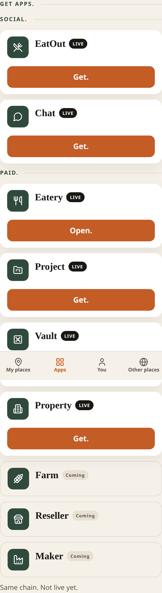
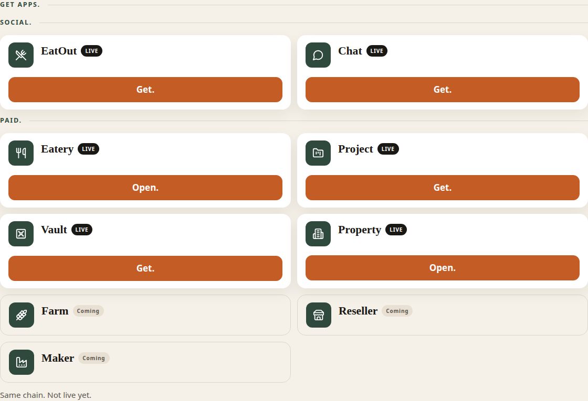
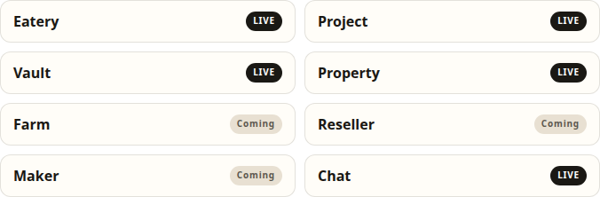
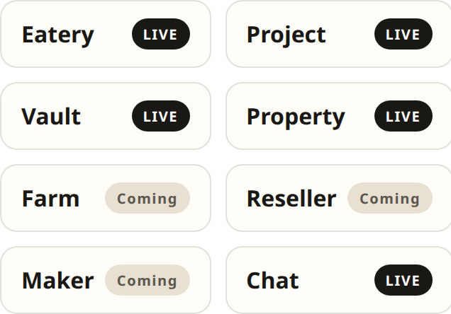
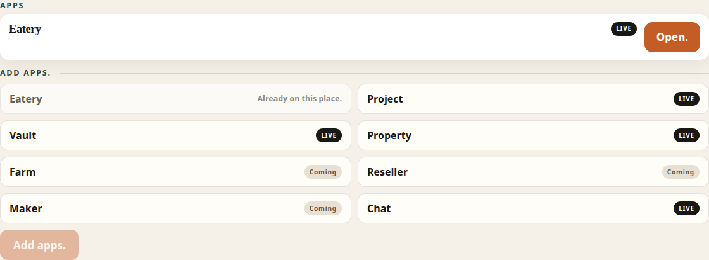
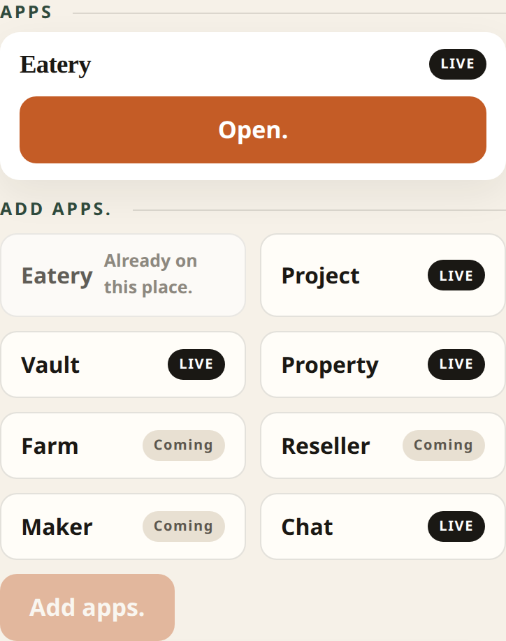

# PR 27 — Property LIVE on Apps.

Kitchen stills from Hub (Vite + system Chrome, `scripts/capture-ux-pr-27.mjs`). Not placeholders.

- Theme: daup-theme cream / terracotta / forest
- Desktop 1280 · mobile 390×844 @2x
- Thumb: **My places · Apps · You · Other places**
- Kitchen doors only. The door says **Property**. It never says Rental.

## What this pack shows

1. **Apps** — **Social.** stays first (EatOut, Chat). **Paid.** keeps LIVE apps ahead of Coming. **Property** is LIVE in Paid, after Vault and before Farm.
2. Before **Get.**, Property shows **Get.** After **Get.**, **Open.** is a same-tab link to `https://property.daup.co.za`.
3. **Which apps should this place run?** and place **Add apps.** list Property as an enableable place app. EatOut stays off that picker.

## Placement

Social is unchanged: EatOut, then Chat.

Paid follows the #25 convention: LIVE apps in the order they joined, then Coming apps that stay Coming.

| Section | Order |
| --- | --- |
| Social | EatOut, Chat |
| Paid | Eatery, Project, Vault, **Property**, Farm, Reseller, Maker |

Farm, Reseller, and Maker stay **Coming**. There is no fee per property. The place meter stays R199, and hosted seed stays R299.

## apps-desktop.png

**Apps** before Get. on Property.

- **Social.** EatOut LIVE **Get.** · Chat LIVE **Get.**
- **Paid.** Eatery LIVE **Open.** · Project LIVE **Get.** · Vault LIVE **Get.** · Property LIVE **Get.**
- Farm, Reseller, Maker **Coming**

## apps-mobile.png

Same doors stacked. **Get.** is a 48px terracotta tap.

## apps-open-desktop.png

After **Get.** on Property.

- Property LIVE **Open.** → `https://property.daup.co.za`
- Same-tab link, `target="_self"`, no extra query
- The hub does not check that the host is up first

## apps-open-mobile.png

Same Open. door stacked.

## wizard-apps-desktop.png

**Which apps should this place run?**

- Eatery, Project, Vault, Property LIVE
- Farm, Reseller, Maker Coming
- Chat LIVE
- No EatOut

## wizard-apps-mobile.png

Same chips stacked.

## place-add-apps-desktop.png

**Open.** on The Olive.

- **Apps** Eatery LIVE **Open.**
- **Add apps.** Eatery **Already on this place.**
- Project, Vault, Property, Farm, Reseller, Maker, Chat pickable
- Property marked LIVE

## place-add-apps-mobile.png

Same chips stacked. Already-on Eatery stays disabled.

## Copy check

Doors scanned in these stills:

- **Property** / **Vault** / **Chat** / **EatOut** / **Eatery** / **Project**
- **Social.** / **Paid.** / **Get.** / **Open.** / **LIVE** / **Coming**
- **Add apps.** / **Already on this place.**
- the door never says Rental
- protocol words stay off doors
