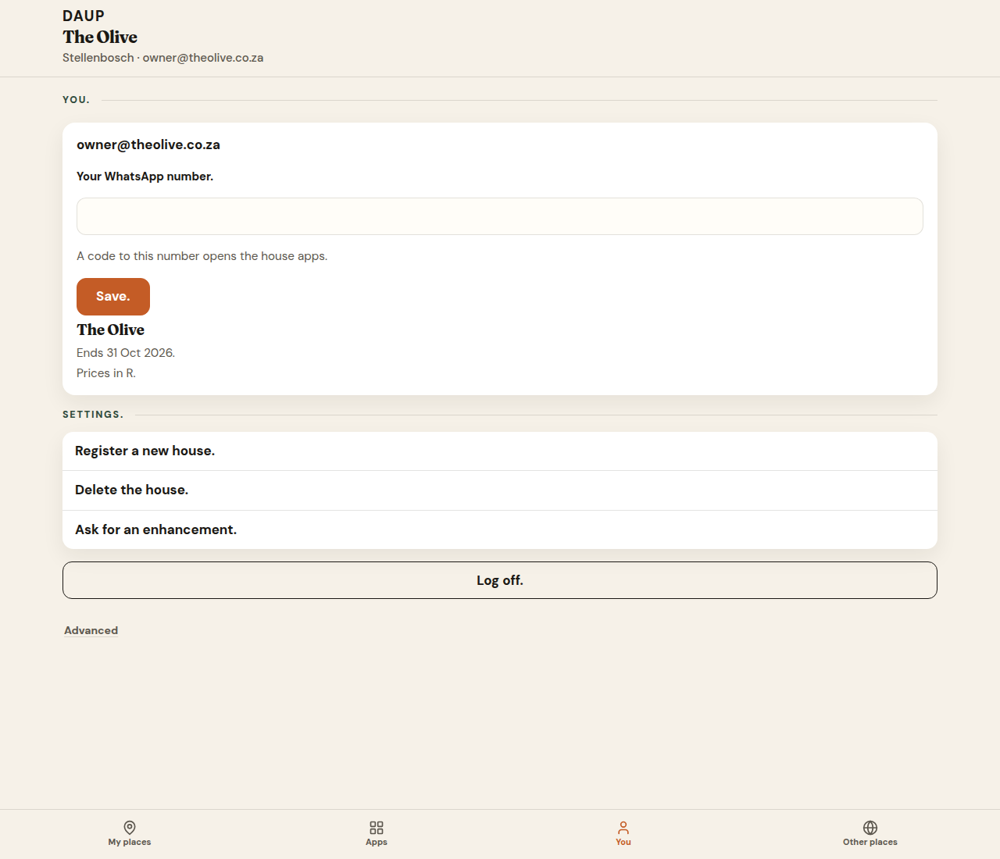
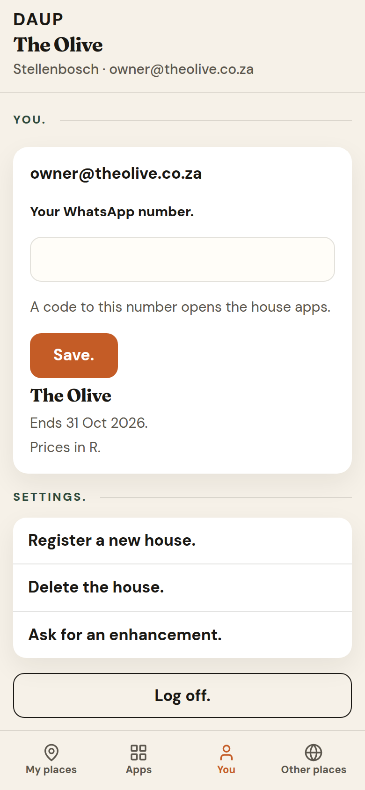
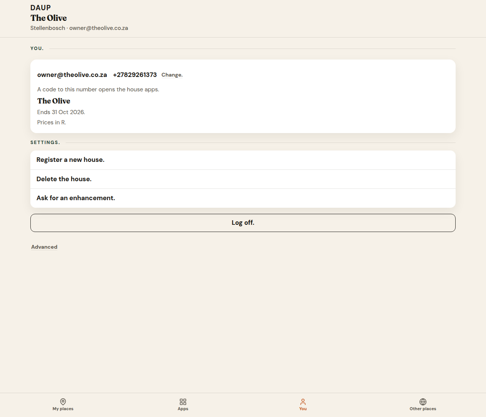
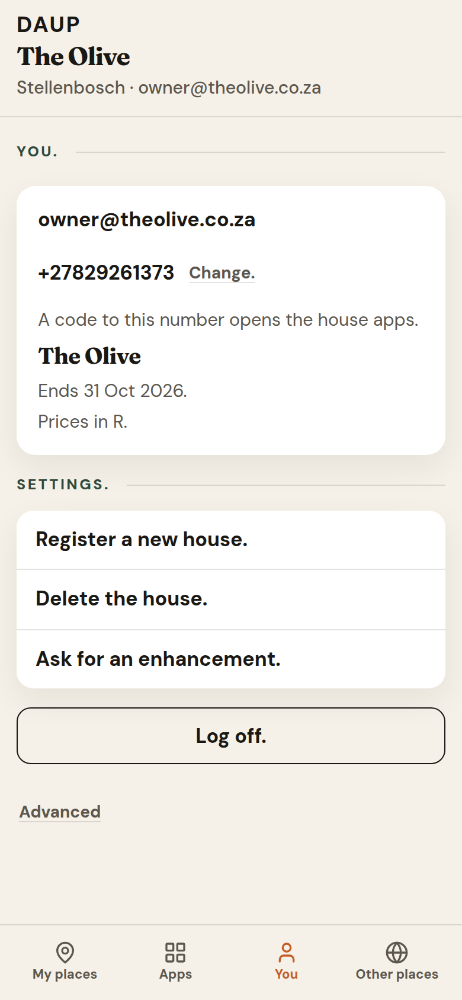
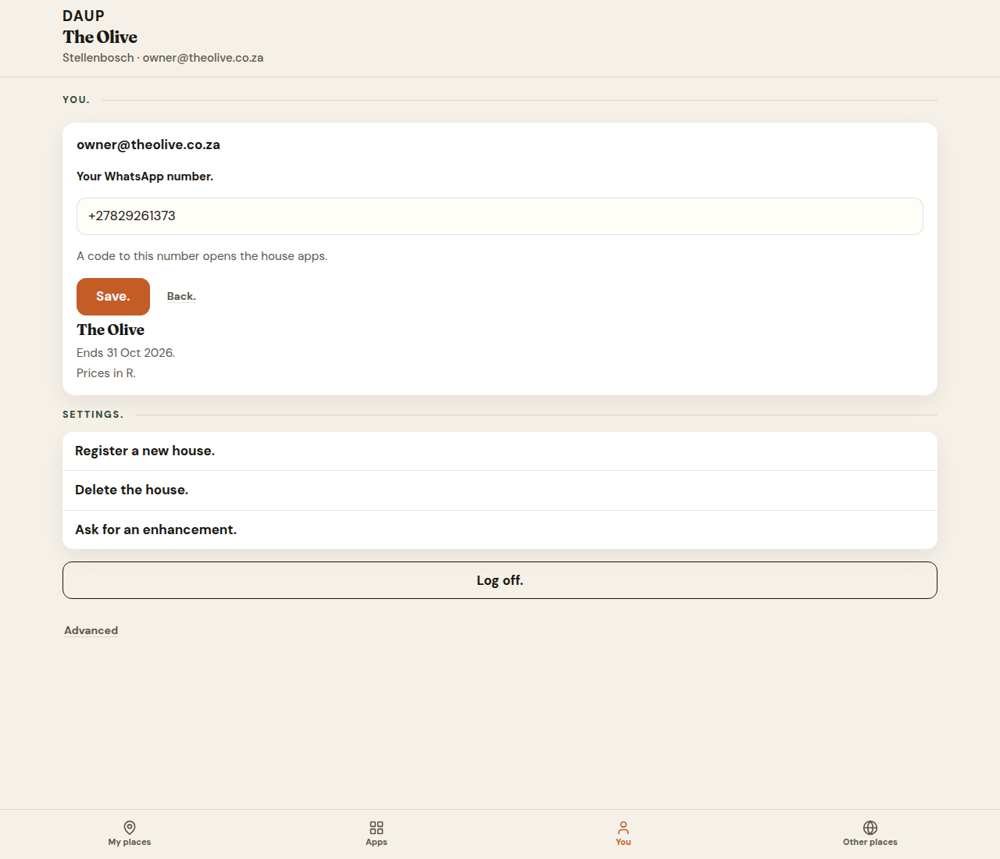
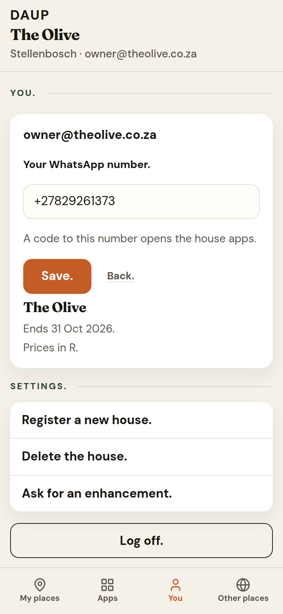
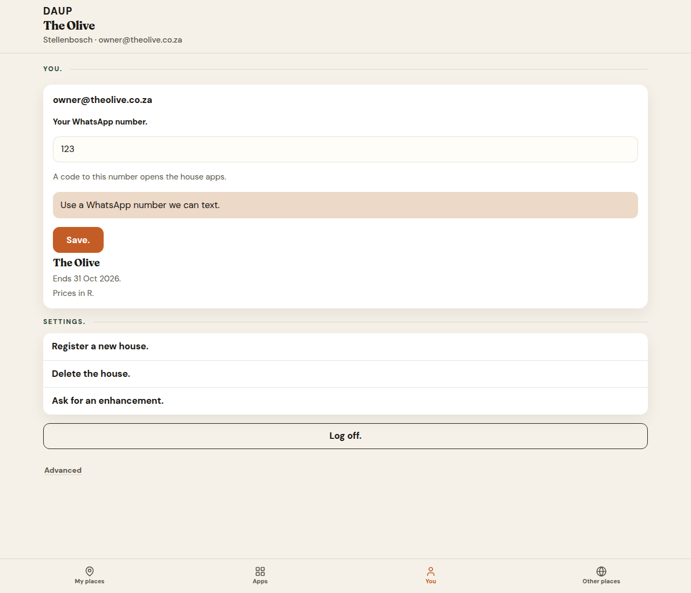
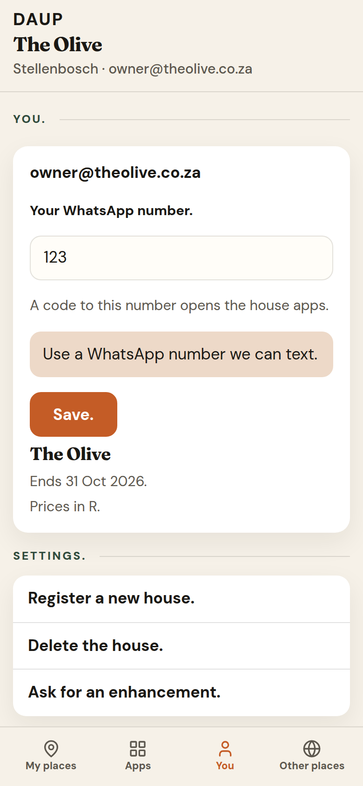

# PR 34 — WhatsApp on You.

Kitchen stills from Hub (Vite + system Chrome, `scripts/capture-ux-pr-34.mjs`). Not placeholders.

- Theme: daup-theme cream / terracotta / forest
- Desktop 1280×1100 · mobile 390×844 @2x
- Thumb: **My places · Apps · You · Other places**
- Kitchen English keeps the full stops on **Save.** **Change.** **Back.**

## You. WhatsApp

The email stays the first fact. The number field is its own block under it.

Empty and editing, top to bottom, with the same 16px air as the rest of **You.**:

- Email
- **Your WhatsApp number.**
- The field
- *A code to this number opens the house apps.*
- **Save.** (and **Back.** while editing)

The hint sits under the field, not under the email. **Change.** and **Back.** are `min-height: var(--tap)` (48px). **Save.** stays on that tap height, with wider horizontal padding.

## you-empty-desktop.png

Signed in. House is **The Olive**. WhatsApp is not set.

- Email
- **Your WhatsApp number.** · empty field · the code sentence · terracotta **Save.**

## you-empty-mobile.png

Same stack. **Save.** is a 48px tap.

## you-saved-desktop.png

`0829261373` saved as **+27829261373**, beside the email. **Change.** is a 48px tap. The code sentence sits under that line.

## you-saved-mobile.png

Same number. **Change.** stays a 48px tap.

## you-editing-desktop.png

**Change.** opens the field with `+27829261373`. Hint under the field. **Save.** and **Back.** side by side, both 48px.

## you-editing-mobile.png

Same editing stack.

## you-error-desktop.png

`123` then **Save.** The peach line is the exact sentence: **Use a WhatsApp number we can text.**

## you-error-mobile.png

Same sentence under the field.
