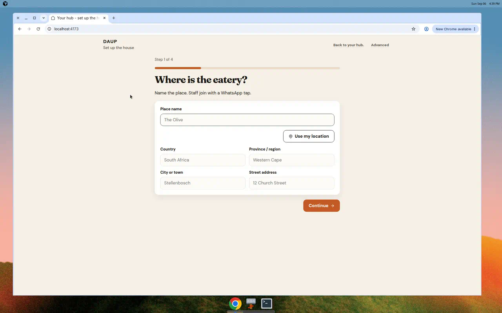

# Register opens Where is the eatery?

From hub home, **Register a new house.** starts the naming wizard.

- Title: **Where is the eatery?**
- Sub: Name the place. Staff join with a WhatsApp tap.
- First-time / no house: **Back to your hub.** returns to empty home
- Already has a house: **Stay with this house.** returns to home
- Completing the wizard names the house and returns to home

