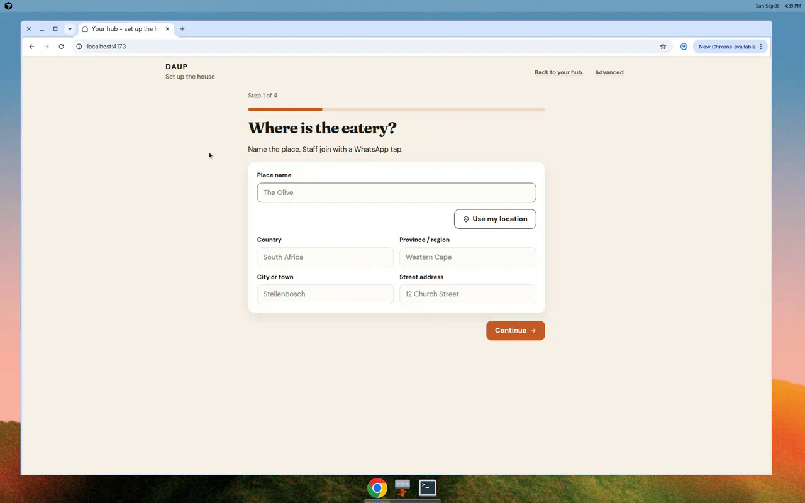

# Register opens Create your company / place

From hub home, **Register a new place.** starts the naming wizard.

- Title: **Create your company / place**
- Then: **Which apps should this place run?** (multi-select; eatery is one of them)
- Sub: Name the place. Staff join with a WhatsApp tap.
- First-time / no house: **Back to your hub.** returns to empty home
- Already has a place: **Stay with this place.** returns to home
- Completing the wizard names the house, binds `companyId` once, and returns to home

PR 18 pack (desktop + mobile): [pr-18/kitchen.md](pr-18/kitchen.md)
