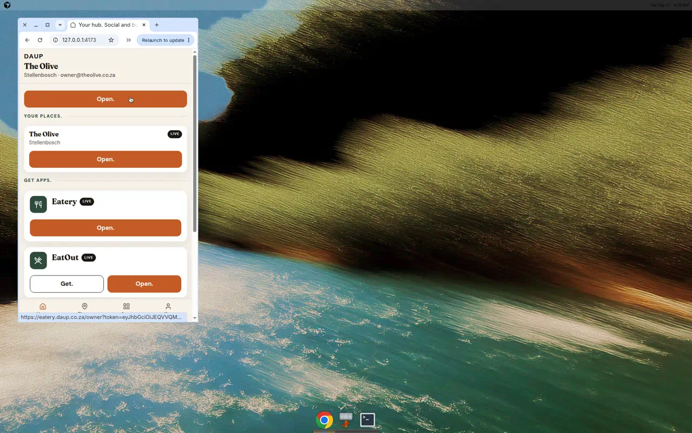

# Returning owner hub home

Signed-in owner who already has a house.

- Lands on hub **home** after email. Does **not** open **Where is the eatery?**
- **Context** is the house name, city, and email — no protocol chrome
- **Open.** is the first tap (terracotta). Held-app **Open.** is outline on Home so it does not fight the page CTA.
- No **Your places.** section on Home. Dense place list lives under thumb **Places.**
- **Get apps.** — held: **Open.** only. Not held: one **Get.** as primary. Never both.
- **On the chain.**
- Bottom thumb nav: **Home / Places / Apps / You**
- **You.** shows **Log off.**, then **Settings.** (**Register a new house.** / **Delete the house.** / **Ask for an enhancement.**), then Advanced
- **Advanced** stays protocol-only, from You

Wizard opens only from **Register a new house.** or **+ Register**.

