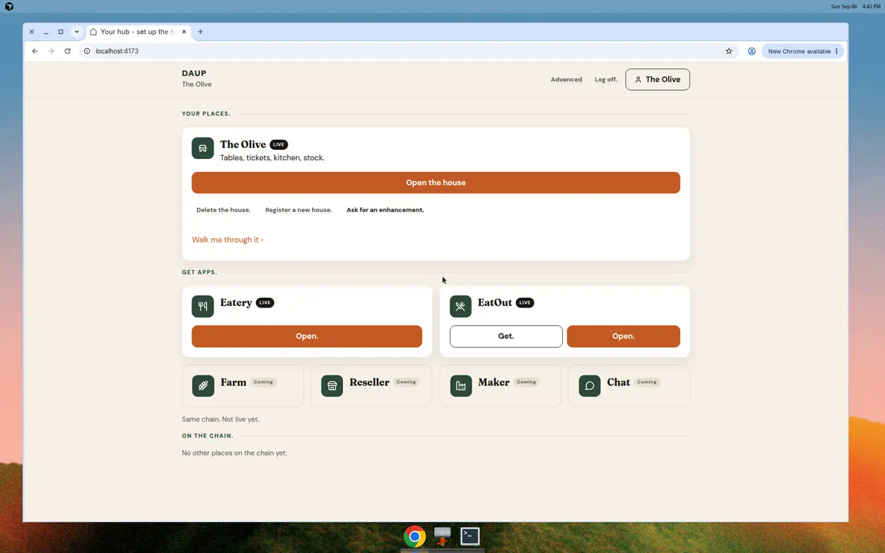

# Returning owner hub home

Signed-in owner who already has a house.

- Lands on hub **home** after email. Does **not** open **Where is the eatery?**
- **Your places.** shows the named house (LIVE) and **Open the house**
- **Get apps.** — Eatery + EatOut LIVE
- **On the chain.**
- **Log off.** **Register a new house.** **Delete the house.** **Ask for an enhancement.**
- **Advanced** stays protocol-only

Wizard opens only from **Register a new house.**

