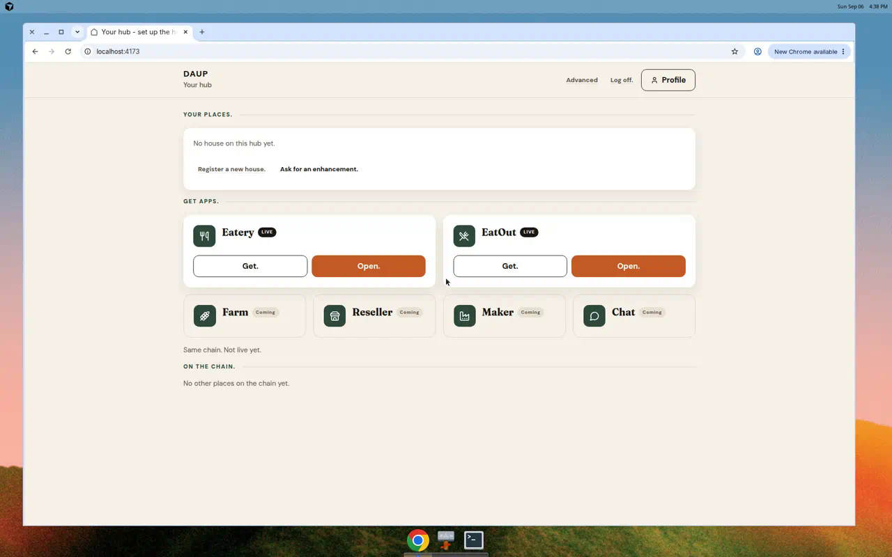
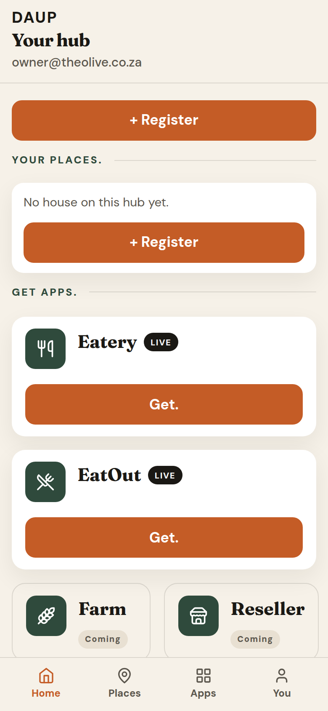

# Signed-in, no house

Email session, no named house.

- Hub **home** first — not the naming wizard
- Context is **Your hub** plus email
- First tap is **+ Register**
- **Your places.** is empty: *No house on this hub yet.* plus **+ Register**
- **Get apps.** (Eatery + EatOut LIVE) and **On the chain.** still show
- **Ask for an enhancement.** and **Register a new house.** live on **You.**
- **Delete the house.** is hidden until there is a house
- Door copy does not assume an eatery-only node

