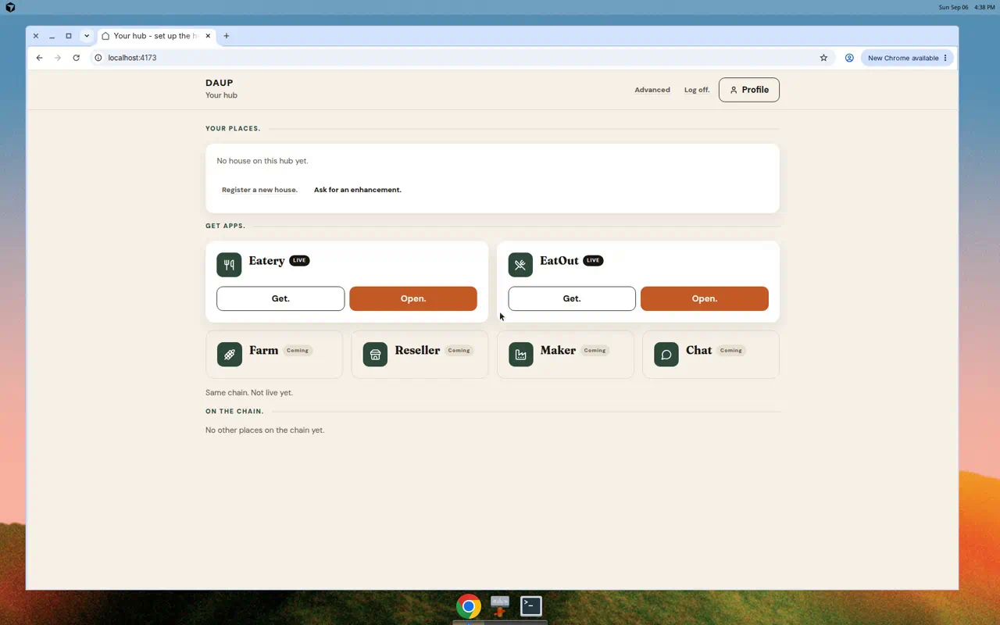
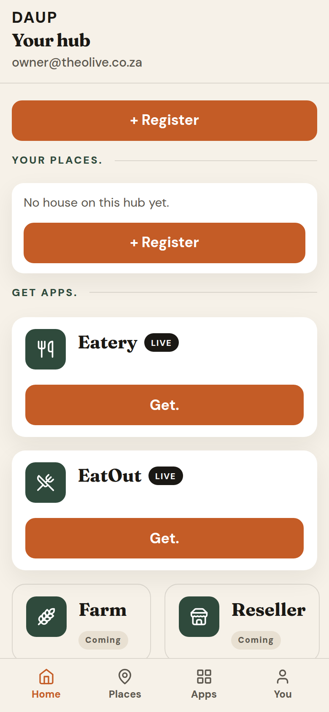

# Signed-in, no house

Email session, no named place. Owner chrome says **place** (Change set 1). Stills below still show the previous word **house**.

- Hub **home** first — not the naming wizard
- Context is **Your hub** plus email
- First tap is **+ Register**
- Empty Home: *No place on this hub yet.* plus **+ Register** — no **Your places.** section
- **Get apps.** (Eatery + EatOut + Project LIVE) — not held, so one **Get.** each. **On the chain.** still shows
- Thumb **Places.** keeps the empty place list
- **Settings.** on **You.** holds **Ask for an enhancement.** and **Register a new place.**
- **Delete the place.** is hidden until there is a place
- **Log off.** stays visible on You. Advanced stays below Settings.
- Door copy does not assume an eatery-only node

