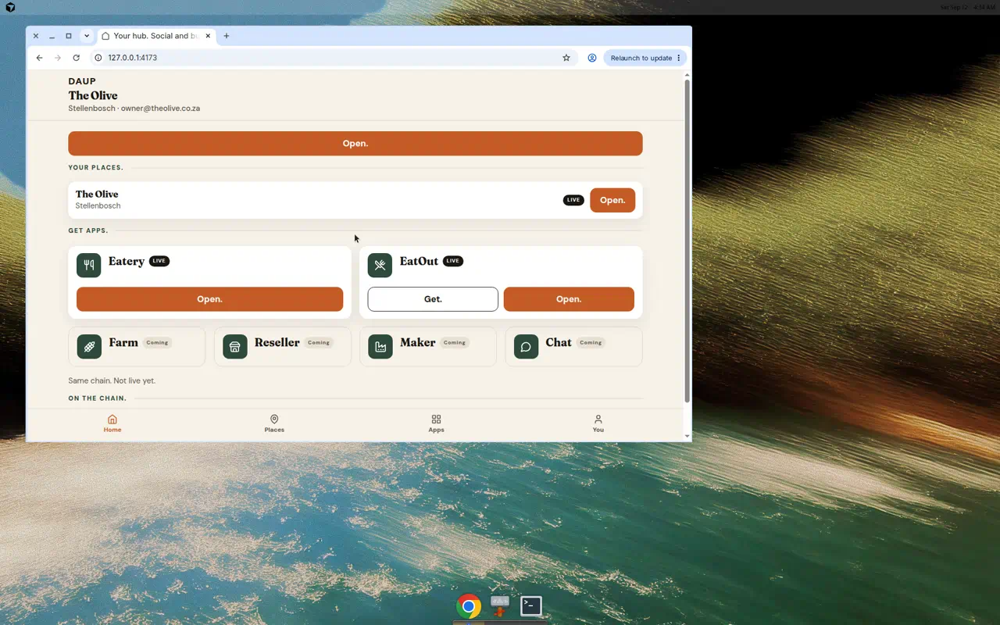
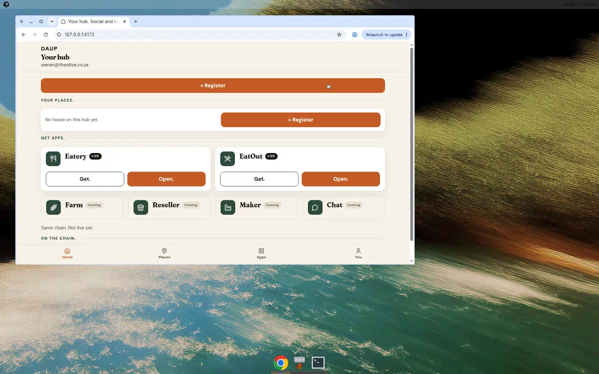
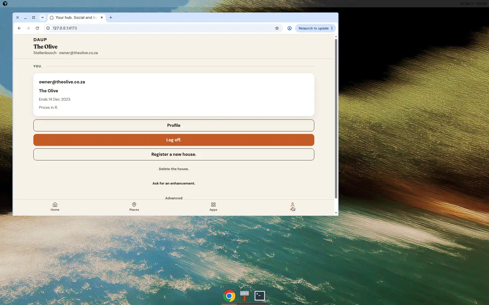
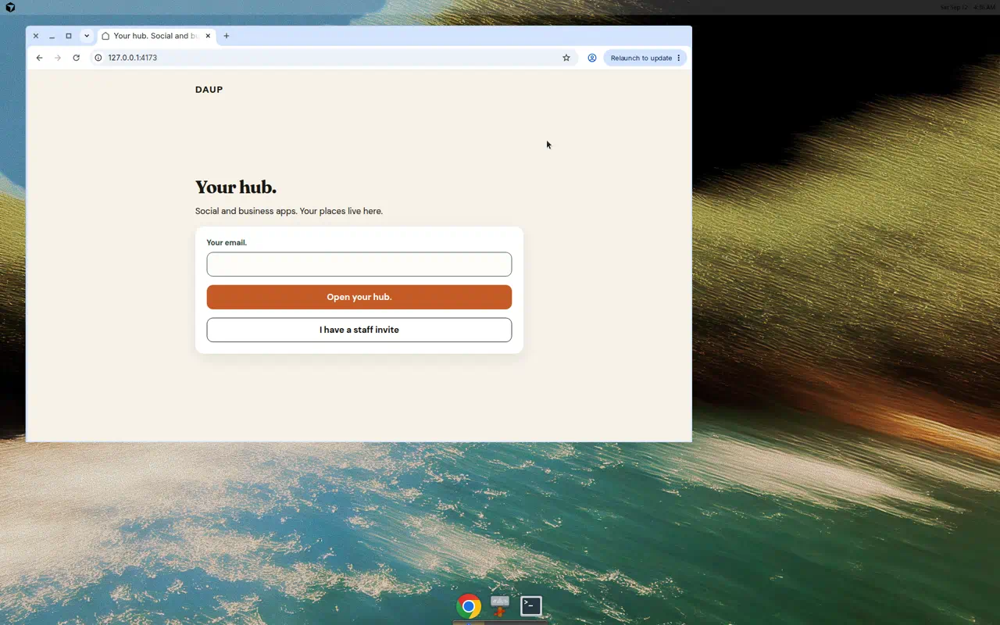
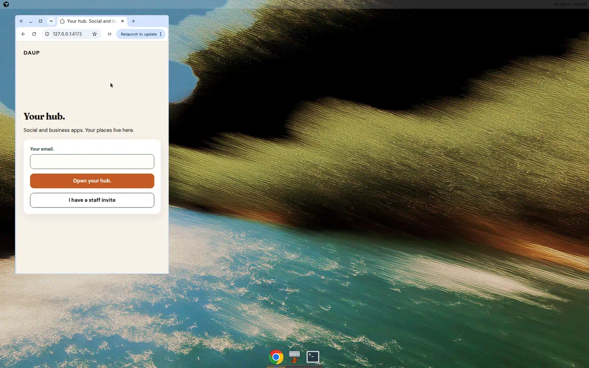

# Sixty60 hub home lock

Signed-in **app.daup.co.za** home. Cream / terracotta / forest only — `daup-theme` tokens.

## Hierarchy

1. **Place context** — house name, city, email. No Advanced, Profile, or Log off.
2. **CTA** — **Open.** when a house is live. **+ Register** when Your places is empty. This is the terracotta primary on Home.
3. **Your places.** — dense row: name / city / LIVE / one **Open.** (outline on Home so it does not fight the page CTA).
4. **Get apps.** — held app: **Open.** only. Not held: one **Get.** as primary. Never Get.+Open. together.
5. **On the chain.**
6. **Thumb nav** — Home / Places / Apps / You

Protocol stays off this surface. Advanced, Log off, Delete, Ask, and Profile live on **You.**

## Empty

No house: *No house on this hub yet.* plus **+ Register**.

## Money and dates

Where money or dates show: **R** and day-first (`14 Dec 2023`). Empty country defaults to Rand.

## Gate (logged out)

Full-viewport cream. Desktop island 640px. **Open your hub.** is a 48px primary. **I have a staff invite** is a 48px outline secondary.

